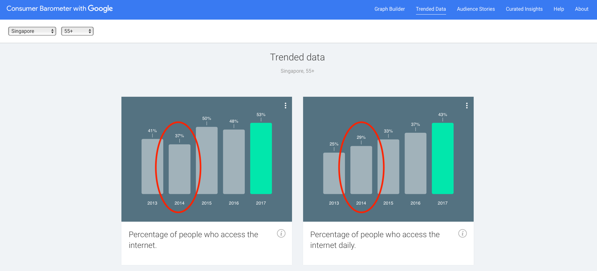
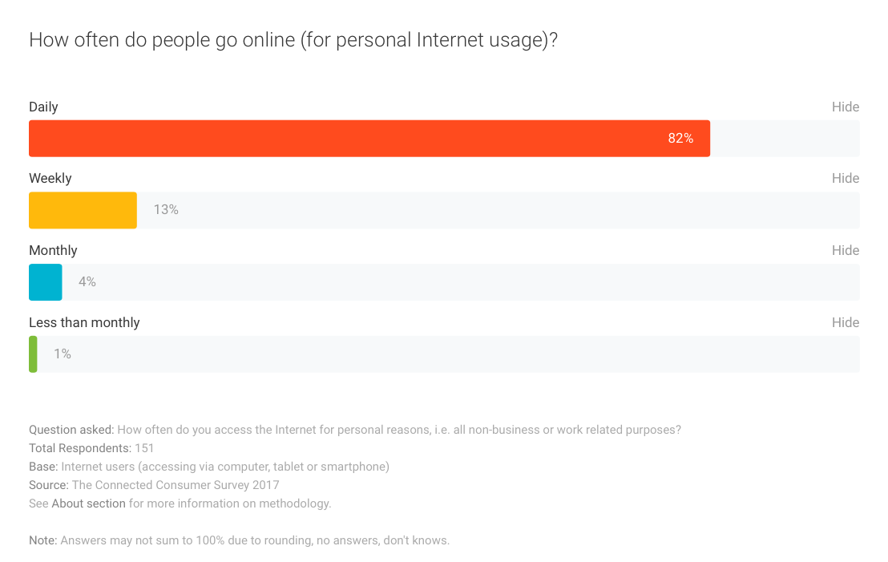

# (PART) Case Studies {-}

# Blown out of proportion {#oop}

- Contributor: Shannon Ang

Proportions (sometimes expressed in percentages) are commonly used in popular media to reflect public opinion. For instance, a news article may state that "nearly 46 per cent of those aged 18 to 25 would allow extremist views that deem all other religions as enemies to be published"^[https://www.todayonline.com/singapore/nearly-1-2-young-sporeans-open-extremist-views-being-posted-online-survey-shows], or that "59 per cent of Chinese find a Malay president acceptable"^[https://www.straitstimes.com/singapore/majority-willing-to-accept-president-or-pm-of-another-race-but-prefer-one-of-their-own]. While these proportions are easy for the general public to understand, they can be misleading if not read carefully. This case study looks at two different news articles, showing how some claims can be exaggerated by careless use of numbers.

## Media claim 1: Support for the Watain ban {#watain}
Swedish black metal band Watain was supposed to perform in Singapore on 7 March 2019. However, the gig was cancelled just hours before it was scheduled to begin, with the government citing concerns from the Christian community^[See https://www.channelnewsasia.com/news/singapore/watain-concert-cancelled-christian-community-reaction-shanmugam-11399434]. To evaluate public sentiment towards this incident, REACH^[The Singapore Government's feedback unit] conducted a poll with 680 Singaporeans aged 15 and above. Of interest here is how results from this poll was represented in public discourse.

> Our assessment of public sentiment turned out to be correct, because a subsequent REACH survey showed that, first of all, that 60% were aware of the cancellation. **Of those who were aware**, 86% of Christians agreed with the cancellation. That I think will be natural. But 64% **of all who had heard about the cancellation**, Christian and non-Christian, also agreed with the cancellation. Twenty-eight percent thought that it should not have been cancelled. 
>
> Minister for Home Affairs K Shanmugam, 1 April 2019, *emphasis mine*

The quote above is [taken directly from the Hansard](https://sprs.parl.gov.sg/search/sprs3topic?reportid=ministerial-statement-1170), and is consistent with the results shown in REACH's [press release](https://www.reach.gov.sg/~/media/2019/press-release/findings-of-poll-on-watain-concert--1-april-2019.pdf). Note the phrases that I bolded for our purposes, which I will call "qualifiers".

```{r st-watain, fig.cap='Screenshot of online article on results from REACH poll. Retrieved May 21, 2019.', out.width='80%', fig.align='center', echo=F}
knitr::include_graphics("images/STwatain.png")
```

The next day, national newspaper The Straits Times ran [a story](https://www.straitstimes.com/politics/singapolitics/parliament-two-out-of-three-singaporeans-back-governments-move-to-cancel) headlined "Parliament: Two in three back move to ban Watain gig". Within the text of the article, it reads:

> The Government decided to cancel the permit for Watain's concert last month when it received reports that mainstream Christians were very concerned and offended by the band, Home Affairs Minister K. Shanmugam said yesterday. And a survey of Singaporeans by government feedback unit Reach found that two in three supported the move, he noted. Among Christians, 86 per cent were supportive of the move to disallow the concert, the Reach poll found.

Note the qualifier "among those who were aware" is neither in the headline nor the body of the article^[CNA ran a similar headline, but included the qualifier within the article. See https://www.channelnewsasia.com/news/singapore/2-in-3-singaporeans-in-reach-poll-supported-government-s-11401066]. 

*Why is this important?* [Results from REACH](https://www.reach.gov.sg/~/media/2019/press-release/findings-of-poll-on-watain-concert--1-april-2019.pdf) show that 63% of respondents were aware, and out of these respondents, 64% supported the government's ban. This means that out of *all* respondents to the survey, only about 40% reported supporting the ban. This means that the qualifying phrase "among those who were aware" meaningfully changes the interpretation of the results - we shouldn't be able to say that **the majority of Singaporeans** supported the ban when in fact only 40% of the survey respondents did so.

In effect, the Straits Times article is invoking a strong (but unspoken) assumption here (see \@ref(ooptech) for a more technical explanation) - that *if* those who were unaware were in fact able to express their support for the ban, the same proportion of respondents (among those who were aware, 64%) would also support the ban. But being aware of the ban is a *prerequisite* for support of the ban, which makes this assumption unreasonable. Even assuming this hypothetical scenario were possible, the actual figure could be higher or lower. Those who were not aware may be less likely to care about black metal music (or simply too busy to keep up with current affairs) and simply base their support of the ban on their general sentiment toward government policies. This seemingly small technical error (of omitting the qualifier) can lead to false conclusions pretty quickly. Let us look at another example.

## Media claim 2: Web-savvy Seniors {#websavvy}

Part of my research involves looking at how Internet use can improve the lives of older adults [see @ang_going_2018]. I was interested in what this looked like in Singapore, and googled something like "internet use seniors". An 2014 article in the Straits Times came up.

```{r st-websavvyseniors, fig.cap='Screenshot of online article on web-savvy seniors. Retrieved May 21, 2019.', out.width='80%', fig.align='center', echo=F}
knitr::include_graphics("images/STwebsavvyseniors.png")
```

Within the article, the reporter states:

> Also, 78 per cent of those aged 55 and older here access the Internet every day either via the traditional Web browser or smartphone apps, putting Singapore fifth in the world for having the most Internet-savvy seniors.

I was immediately blown away. Over and above my anecdotal experience with Singapore older adults, past research in the United States^[For instance, see https://www.pewinternet.org/2012/06/06/older-adults-and-internet-use/] gave me reason to expect that the proportion of older people even using the Internet (everyday or not) should be much lower. Some results from Consumer Barometer are available online, so we can [check for ourselves](https://www.consumerbarometer.com/en/trending/?countryCode=SG&category=TRN-AGE-55-PLUS). Of interest here is the figure for 2014, which is when the article was written. Note that the percent of Singaporeans aged 55 and above who use the internet daily **is 29%, not 78% as the article suggests.** 

```{r cb-seniorsinternet, fig.cap='Screenshot of Consumer Barometer findings across time. Retrieved May 21, 2019.', out.width='80%', fig.align='center', echo=F}

```

How then, did the reporter get things so wrong? While detailed statistics for 2014 doesn't seem available online anymore, a little investigation using 2017 figures shows how the reporter arrived at the higher number.

```{r cb-single, fig.cap='Screenshot of Consumer Barometer results on 2017 internet use. Retrieved May 21, 2019.', out.width='90%', fig.align='center', echo=F}

```

The crucial part of Figure \@ref(fig:cb-single) is the footnote that says "base", which tells us that the 82% figure for daily Internet usage in 2017 are **among those who use the internet**. We can easily calculate this 82% ourselves by using the numbers in Figure \@ref(fig:cb-seniorsinternet) - note that 43% is approximately 82% of 53%. That is, $\frac{43}{53} \approx 0.82$. Using the same strategy, we can recover the reporter's figure for 2014: $\frac{29}{37} \approx 0.78$. 

*What does this mean?* This means that just like the reporter in the Watain example (\@ref(watain)), this reporter left out an important qualifier - only 29% of all older adults in Singapore use the internet daily, but 78% **of those who use the internet** use it daily. This vast discrepancy is highly consequential - the statement that "78 per cent of those aged 55 and older here access the Internet every day" is false, and the headline that "Majority of Singapore seniors are Web savvy" is misleading at best.

## Technical Appendix {#ooptech}

Before we go into a more technical explanation of what went wrong in these two cases, let us first move from proportions to probabilities. The difference between a proportion and a probability is important here. Note that when Minister Shanmugam said that the REACH poll provided evidence that the Government's "assessment of public sentiment turned out to be correct", he was not suggesting that 680 Singaporeans form the whole Singapore public. The underlying assumption was that since most survey respondents (who were aware) supported the ban, it is likely that most Singaporeans (who are aware) will also support the ban. That is, he was using the *proportion* of supportive survey respondents (a description of the sample), to infer the *probability* of any one Singaporean supporting the ban. 

The difference between a probability and a proportion may be simplified using a coin flip example. If I flip a fair coin 4 times, the proportion of heads may be 0, 0.25, 0.5, 0.75, or 1. However, since it is a fair coin, the probability of getting a heads is by definition 0.5. So the proportion may or may not equal the probability. What we know is that the more times I flip the coin, the more likely the proportion of heads. will reflect the probability of getting a heads. It is thus common to hear people say that the probability is the long-run proportion of an event. Below is some code (in R) for you to try out the coin flip example.

```{r eval=F}
# Set the number of trials to 4, you may change this number
n <- 4 
# Calculate the proportion of heads, based on flipping a fair coin
sum(rbinom(n, 1, prob=0.5))/n 
```

Now that we have established the only reason why we are interested in proportions from a REACH poll is that they purport to tell us something about Singaporeans in general - that is, if we were to randomly pick a Singaporean from those who are aware of the ban), the probability of this person supporting the ban is about 0.64 (or 64%). The problem at hand then reduces to a trivial probability question, assuming that we all remember basic probability rules from secondary (primary?) school^[Or that we can Google it if not]. If the REACH poll is indeed representative of all Singaporeans, then we have the following quantities:

$$
\Pr(\text{Aware of Ban}) = 0.63 \\
\Pr(\text{Not Aware of Ban}) = 1 - \Pr(\text{Aware of Ban}) = 0.37 \\
\Pr(\text{Support Ban } | \text{ Aware of Ban}) = 0.64 \\
$$

$\Pr(\text{Support Ban } | \text{ Aware of Ban})$ is a conditional probability, but the quantity that is being asserted in the article is $\Pr(\text{Support Ban})$ - the total probability. Using the law of total probability, we know that:

$$
\begin{aligned}
\Pr(\text{Support Ban}) &= \Pr(\text{Support Ban } | \text{ Aware of Ban})\cdot \Pr(\text{Aware of Ban}) \\
& \quad + \Pr(\text{Support Ban } | \text{ Not Aware of Ban})\cdot \Pr(\text{Not Aware of Ban})
\end{aligned}
$$


Plugging in the numbers that we have, 

$$
\begin{aligned}
\Pr(\text{Support Ban}) &= 0.64 \cdot 0.63 + \Pr(\text{Support Ban } | \text{ Not Aware of Ban}) \cdot 0.37
\end{aligned}
$$

we see that $\Pr(\text{Support Ban}) = 0.64$ if and only if $\Pr(\text{Support Ban } | \text{ Not Aware of Ban})$ also equals 0.64. That said, $\Pr(\text{Support Ban } | \text{ Not Aware of Ban})$ is logically impossible, and should equal zero. 

Similarly, in the Web-savvy Seniors example,

$$
\begin{aligned}
\Pr(\text{Use Internet Daily}) &= \Pr(\text{Use Internet Daily } | \text{ Use Internet})\cdot \Pr(\text{Use Internet}) \\
& \quad + \Pr(\text{Use Internet Daily } | \text{ Don't Use Internet})\cdot \Pr(\text{Don't Use Internet}) \\
&= 0.78 \cdot 0.37 + \Pr(\text{Use Internet Daily } | \text{ Don't Use Internet})\cdot 0.63
\end{aligned}
$$
where $\Pr(\text{Use Internet Daily } | \text{ Don't Use Internet})$ is impossible and should be zero. In both cases, total probabilites are quite different from the conditional probabilities.

## Conclusions
By now, it should be clear that qualifiers attached to proportions (and percentages) are critical. Without them, results from studies can be blown out of proportion. It is not wise to completely rely on assertions made by news articles (or other kinds of reports), even from supposedly credible agencies like the Straits Times. As we have seen, social scientists should be comfortable with interpreting data from its source^[this, however, first requires data to be made available for replication purposes.] in order to evaluate claims that are being made in public discourse today.


