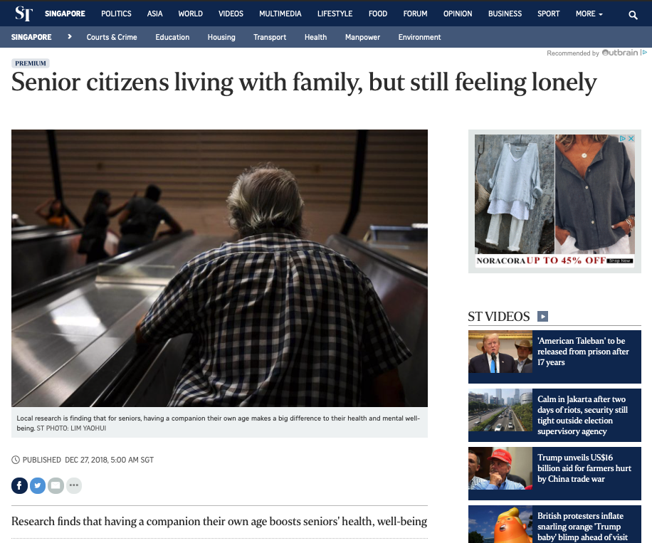
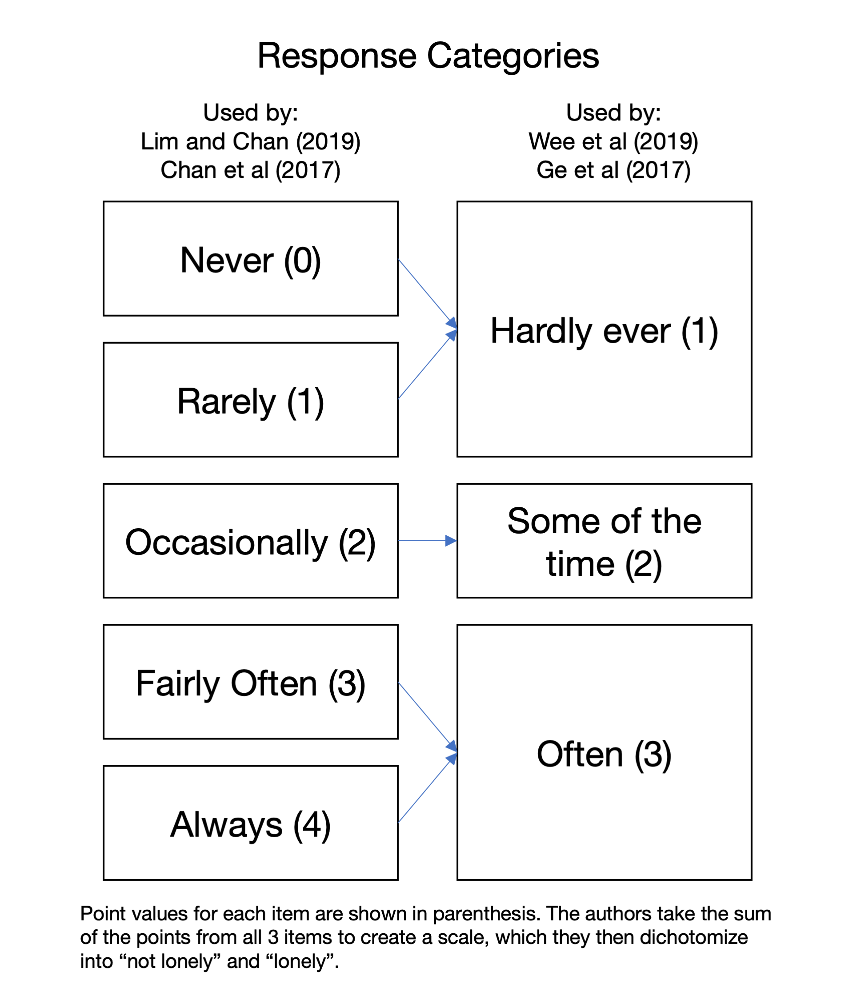

# Are we lonely? {#lonely}

```
Contributor: Shannon Ang
Date: 25 May 2019
```

In population health research, there are a number of commonly used scales to measure psychosocial well-being. For instance, the [Center for Epidemiologic Studies Depression Scale](https://www.apa.org/pi/about/publications/caregivers/practice-settings/assessment/tools/depression-scale) (CES-D) is widely used to measure depression, and the [EQ-5D](https://euroqol.org/eq-5d-instruments/)^[There's no 'full' name for this, its just referred to as the EQ-5D.] to measure quality of life. These scales seldom have a intuitive interpretation - who knows what 10 points on the CES-D scale actually means in 'real life', versus 12 points? To address this, social scientists often choose a "cut-off" point to simplify the measure into two categories (e.g., either you are depressed, or you are not). Some of these cut-off points are well researched (such the cut-off point for mild cognitive impairment), while others are more arbitrary.

This case study looks at the prevalence of loneliness in Singapore older adults, and how these cut-offs can shape the way we think about it. The focus here is *not* to criticize researchers' choices of cut-off points. Instead, this case study seeks to provide a way to evaluate claims that based on these cut-offs, so that we understand how to compare claims across studies and/or reports. 

## The lonely dichotomy

Loneliness is a real issue for many people today, and it has been shown to have deleterious effects on health [@rico-uribe_association_2018]. More of us are beginning to realize this. The Straits Times carried an [article](https://www.straitstimes.com/singapore/living-with-family-but-still-feeling-lonely) in 2018, with the headline "Senior citizens living with family, but still feeling lonely".

<br>
```{r st-lonely, fig.cap='Screenshot of online article on lonely seniors. Retrieved May 25, 2019.', out.width='80%', fig.align='center', echo=F}

```
<br>

But what does **feeling lonely** really mean? There seems to be a dichotomy being drawn here - either you feel lonely, or you don't feel lonely. There is little room for nuance like "I am lonely when I ride the bus by myself". Of course, some level of simplification is needed to compare across groups - and this simplification is what we need to examine.

The news article highlights studies on loneliness done by two different groups - a team at the National Healthcare Group (NHG), and a team at the Centre for Ageing Research and Education (CARE) in Duke-NUS Medical School^[Led by Associate Professor [Angelique Chan](https://www.duke-nus.edu.sg/hssr/our-team/faculty/faculty-staff-details/Detail/13200)]. As we will see, this dichotomy is drawn by reseachers as well, but sometimes **in completely different ways**. Let us take a closer look.

## Lonely by whose standard

The studies of interest^[All these studies are open-access articles, anyone can access them even without a library subscription.] here are @wee_loneliness_2019, @ge_social_2017, @lim_association_2017, and @chan_loneliness_2015. All of these studies use a variant of the 3-item UCLA Loneliness Scale [@hughes_short_2004]. The 3-item UCLA loneliness scale consists of three questions, which all of these studies use:

1. How often do you feel you lack companionship? 
2. How often do you feel left out? 
3. How often do you feel isolated from others?

For each of the questions listed above, respondents were given a range of responses to choose from. These are listed in Figure \@ref(fig:st-lonely-graph). As you might notice, they were different across the studies. @wee_loneliness_2019 and @ge_social_2017 had only 3 response categories (the right column), while @lim_association_2017 and @chan_loneliness_2015 had 5 different response categories (the left column). I put the point values for each response in parentheses. In all of these studies, researchers added up these points across the 3 questions, and came up with their own 'cut-off' point to determine who was "lonely". 

<br>
```{r st-lonely-graph, fig.cap='Summary of response categories', out.width='50%', fig.align='center', echo=F}

```

<br>

The **blue arrows** in Figure \@ref(fig:st-lonely-graph) are added by me to show how the 5 category option can be mapped to the 3 category option (but not vice versa). We don't really know what kind of bias this will introduce^[For instance, one might argue that respondents might choose differently when given more gradational categories.], but at face value I think this looks pretty reasonable. Why am I doing this? This "matching" allows us to do a little experiment with publicly available data^[So you can try it yourself] to answer the following question: **How does changing the criteria change our view of loneliness in Singapore?** The next section compares these different coding schemes.

## Same data, different results

For this simple analysis, I use data from Wave 2 of the Panel on Health and Ageing of Singaporean Elderly (PHASE) (see \@ref(phase)), conducted in 2011. This is a nationally representative study of older adults aged 60 and above. It is essentially the same dataset used in @lim_association_2017 and @chan_loneliness_2015. Code provided is in R. For the sake of brevity, I leave out observations with any missing values on any of the loneliness items. A key concern of the news article in Figure \@ref(fig:st-lonely) is that even older adults living with family members may be lonely, so we will look at a cross-tabulation of living arrangements with "loneliness".

<br>

**Coding scheme 1: Lots of loneliness**

I first follow the coding scheme in @lim_association_2017 and @chan_loneliness_2015. I sum the items up (giving me a score that ranges from 0-12), and then dichotomize respondents into people who are "not lonely" (score of 0), and those who are "lonely" (score of 1-12)^[Note that @chan_loneliness_2015 further splits the "lonely" group into "sometimes lonely" and "mostly lonely". @lim_association_2017, however, does not make this distinction. I have grouped them together since this is the way that it has usually been represented in public discourse (e.g., the claim that those who are lonely have a higher risk of mortality compared to those not lonely. See, for instance, https://www.straitstimes.com/singapore/those-who-feel-lonely-more-prone)]. This cut-off point seems to have arisen from a "common-sense" approach rather than any kind of formal testing - that is, group the people who never experience loneliness in one group, and then put the rest who have had some experience of loneliness in another.

```{r include=FALSE}
library(haven)
phase <- read_dta("/Users/shannon/Dropbox/Datasets/PHASE123/LATEST_ PHASE_Wave 1_Wave 2_Wave 3_Data May 2017/PHASE_1_2_3 Stata/PHASE_1_2_3.dta") %>% zap_labels()
livingarr <- factor(phase$w2_livingarr2, 
                    labels=c("Living alone", "Living with spouse only",
                             "Living with child only", "Living with spouse and child",
                             "Living with others only"))
```

```{r table-lonely1, tidy=FALSE}
# Load required libraries
library(dplyr)

# Note: You first need to read in the data
# The data already contains a pre-coded version according to these criteria
lonely1_cat <- phase$w2_loneliness_yesno %>%
    factor(labels=c("Not lonely", "Lonely"))
# Make a table (proportions are weighted to account for survey design)
knitr::kable(
  GDAtools::prop.wtable(livingarr, lonely1_cat, 
                      dir=1, digits=3, w=phase$w2_weights, na=F, mar=F), 
  caption = paste0('Crosstabulation using criteria in Lim and Chan (2017)',
                   'and Chan et al (2015). Note that these are row percentages.'),
  booktabs = TRUE)
```

<br>

Table \@ref(tab:table-lonely1) gives me a similar proportion as suggested in the news article - that is, 

>"[Associate Professor Chan's study] found that half of Singaporeans over 60 felt lonely some or most of the time. But those who lived with spouses, or with spouses and children, did not."

<br>
These numbers are indeed worrying. Older adults living alone are understandly lonely, but those who live  with their children (but without their spouse) are not that far behind (50.1%!). Even 28% of those who live with their spouse and child feel lonely, like the news article (Figure \@ref(fig:st-lonely)) suggests.

<br>

**Coding scheme 2: Not that much loneliness**

We then arrive that the coding scheme used by @wee_loneliness_2019 and @ge_social_2017. Summing the items gives me a score that ranges from 3-9, and I then dichotomize the group into people who are "not lonely" (score of 3-5), and those who are "lonely" (score of 6-9). Note that these cut-points are probably arbitrary - while the researchers cite a paper each to justify their use of the cut-point, the cited papers do not really provide evidence in support of the cut-point. The closest support for the cut-point in the cited papers that I could discern is in @steptoe_social_2013, which states that they used the top quintile^[In their sample, not the Singapore one.] to define loneliness. No reason was given as to why the top quintile was chosen. Table \@ref(tab:table-lonely2) shows the distribution of "loneliness" according to these criteria.

<br>
```{r table-lonely2, tidy=FALSE}
# Recode and sum the loneliness scores
lonely2 <- phase %>% 
  select(w2_Q10_1_GV1, w2_Q10_2_GV1, w2_Q10_3_GV1) %>%  
  mutate_all(funs(recode(.,`0` = 1, `1` = 1, `2` = 2, `3` = 3, `4` = 3))) %>%
  rowSums()

# Categorize according to cut-off point
lonely2_cat <- if_else(lonely2 < 6, 0, 1) %>% 
  factor(labels=c("Not lonely", "Lonely"))

# Show table
knitr::kable(
  GDAtools::prop.wtable(livingarr, lonely2_cat, 
                      dir=1, digits=3, w=phase$w2_weights, na=F, mar=F), 
  caption = paste0('Crosstabulation using criteria in Wee et al (2019)',
            'and Ge et al (2017). Note that these are row percentages.'),
  booktabs = TRUE)
```

<br>

What you will immediately realize is that these numbers are way lower than those when using coding scheme 1 (that is, the coding scheme of @lim_association_2017 and @chan_loneliness_2015). These numbers are more consistent with the figures shown in @ge_social_2017^[Note that the sample in @ge_social_2017 is of all adults aged 21 and older, not just older adults, so the lower number is expected. Note also that in the paper, the authors show column percentages instead of row percentages. Since we are comparing across living arrangementsm however, row percentages are more appropriate.]. Further, the difference in the proportion of those living alone and those living with their child (but without their spouse) is similar in absolute terms, but much smaller in relative terms (see \@ref(tab:table-lonely3)). While the proportion of those lonely among those who live alone is 2 times that of those living with only their children according to coding scheme 1, this ratio reduces to 1.2 when using coding scheme 2. Overall, based on these results, it seems that the loneliness situation is much less dire than before.

<br>
```{r table-lonely3, tidy=F, echo=F}
codingone <- c(15.6, 7.8, 7.8, 15.6/7.8)
codingtwo <- c(59.2, 50.1, 9.1, 59.2/50.1)
data <- cbind(codingone, codingtwo)
rownames(data) <- c("(1) Living alone", "(2) Living with child only", "Difference [(1) - (2)]", "Ratio [(1)/(2)]")
colnames(data) <- c("Coding scheme 1", "Coding scheme 2")
data <- round(data, 1)
knitr::kable(
  data, 
  caption = 'Comparison of absolute and relative differences',
  booktabs = TRUE)
```

<br>

## Conclusion

So which way of conceptualizing loneliness is "right"? As I mentioned at the start of this case study, that is not the goal here. The process of figuring out a useful cut-off point is a long and tedious one that requires researchers to engage with each other^[And Singapore social science can use more of this.]. Rather, the goal here has been to highlight that decisions like cut-off points may seem small, but are critical. In this case study, these cut-off points essentially define who is considered lonely. **If these cut-off points are vastly different, we are probably not even talking about the same people**. This means that when comparing or drawing conclusions from the findings of different studies, it is crucial that we understand how they were arrived at.


