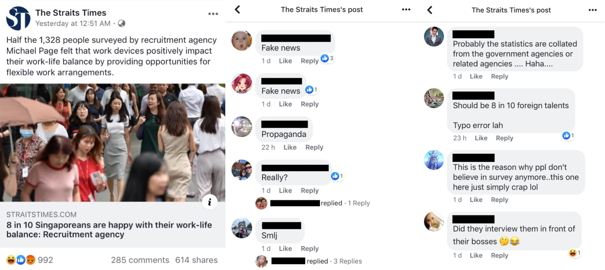
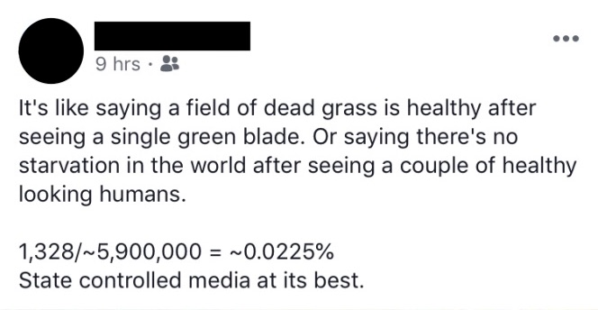
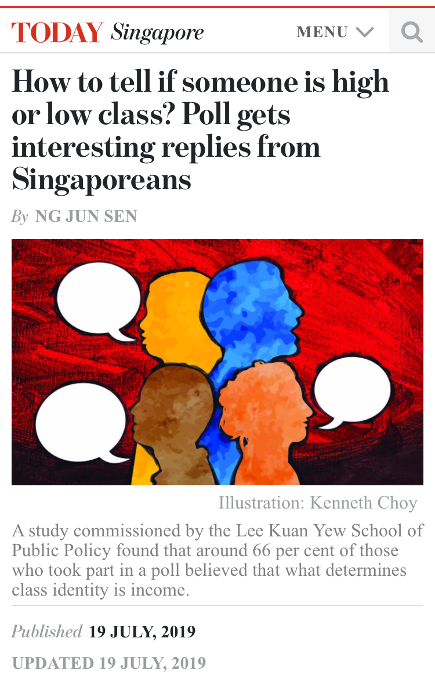
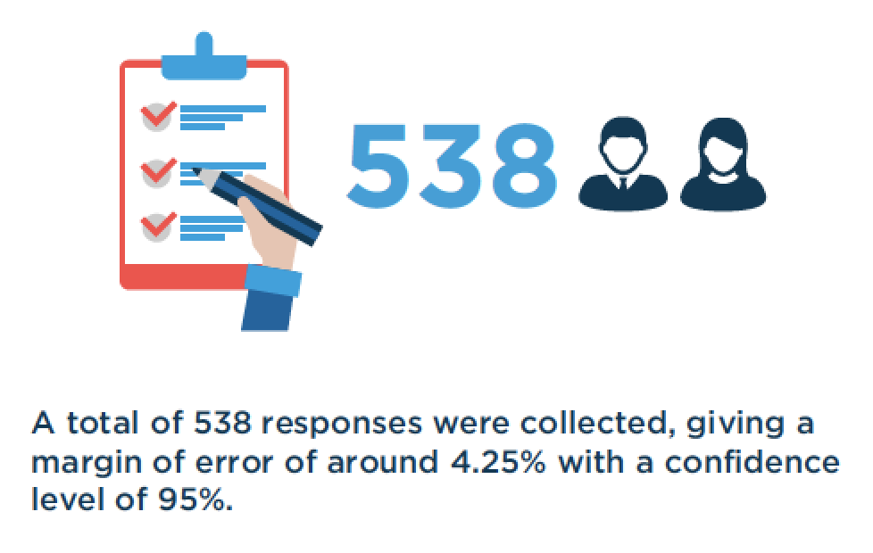

# Size is not all that matters {#samples}

```
Contributor: Shannon Ang
Date: 22 July 2019
```

In response to public surveys, it's quite common to hear people make comments like "they asked only 1000 people, how accurate can it be?". Of course, people tend to only say these things when the findings presented are incongruent with their perception of reality. 

This case study looks at whether and how size makes a difference when we're trying to understand survey results from samples of the population. My hope is for you (the reader) to realize that often, *how* the sample is drawn (and how we quantify uncertainty) is more important than the size of the sample.

## But it's too small! {#sample-worklife}

We will first look at an example. Local newspaper The Straits Times recently reported the findings of a [study done by Michael Page](https://www.michaelpage.com.sg/advice/career-advice/work-life-balance/singapore-happy-work){target="_blank"}, alleging that **8 of out 10 people are "happy" with their work-life balance**.

<br>
```{r st-worklife, fig.cap='Screenshot of online article on work-life balance. Retrieved July 16, 2019.', out.width='90%', fig.align='center', echo=F}

```
<br>

Many people on social media spoke out against the findings (not unexpectedly), questioning how reliable these findings were. These commentators probably felt such findings could not possibly reflect reality, given their own experiences. Surely, they might believe, more people are unhappy with their work-life balance. To rationalize this incongruence, there will inadvertently be some attention drawn to the sample size.

<br>
```{r st-samplesize, fig.cap='Screenshot of comment on work-life balance article. Retrieved July 16, 2019.', out.width='60%', fig.align='center', echo=F}

```
<br>

The comment above (Figure \@ref(fig:st-samplesize)) shows how people often rationalize their feelings toward studies that don't reflect their own perception^[For studies that do agree with the layperson's perception, one probable response would be that it is "common sense" and that there is "no need to do a study to know this".]. How can 1328 survey respondents represent an entire population of approximiately 5.9 million individuals?

The frustrating thing about the [report by Michael Page](https://www.michaelpage.com.sg/advice/career-advice/work-life-balance/singapore-happy-work){target="_blank"} is that it is **not transparent about its methodology**. Without this information, we cannot know for sure about how generalizable these findings are to the whole population. They likely cannot say much about *all Singaporeans* - the results may be limited to Singaporeans who took the survey, who may be a very different group of Singaporeans compared to those who did not take the survey.

This is not an isolated case - it often is difficult to find out exactly how surveys like these (that is, surveys aimed at generating public interest and reported by the media) were conducted. As we will see, the key questions are these: **How were respondents recruited, and how is uncertainty being estimated?**

## Size matters, but how so?

It is true that size matters. However, people tend to paint some variant of this false dichotomy - results are accurate if the sample size is arbitrarily large (e.g., ~50k individuals, or some percentage of the population size), and completely inaccurate otherwise. But more data doesn't necessarily mean appropriate data. For instance, having data on all Singaporean Chinese doesn't really help me understand Singaporean Malays better. The dichotomy is also terribly unhelpful, because what we want is to be able to draw big conclusions from small data^[The obsession with big data is sometimes misguided, especially if this suggests 'small data' is useless or inferior. Big data is mostly useful for other reasons rather than its 'bigness' (i.e., the sheer number of observations). See Matthew Salganik's subsection on this in his book *Bit by Bit* for a good treatment of this subject: <https://www.bitbybitbook.com/en/1st-ed/observing-behavior/characteristics/big/>{target="_blank"}]. In fact, we do this all the time - we conduct interviews to hire people, we date others before entering into a serious relationship, we administer written tests to measure area-specific knowledge, we audition actors before casting them in a role, and more. While understanding that these processes are not perfect, we do expect them to provide us with sufficient information on which to base our bigger decisions. 

**But how certain can we be?** This question is key. First, we need the following information: what are the sampling probabilites for each respondent in the sample? In other words, how likely is each member to be selected into the sample? If they were selected at random^[Random here means that every person in the population has an equal (or known) chance of being selected. It does not mean I randomly approach someone on the street, since certain types of people are more likely to be selected with this method (e.g., people who live close to that street, people who are around at that time, etc.). Usually, in Singapore, researchers who want a random sample get a list of household addresses from the Department of Statistics. It is assumed that the Department of Statistics provides a random sample of all household addresses, but I am not privy to what happens exactly.], there are established methods to calculate uncertainty around our findings^[Via the Central Limit Theorem. If the quantity of interest is a proportion/probability, then the normal approximation property (and its assumptions) also needs to be invoked. The point here, however, is not to demonstrate the Central Limit Theorem, but to demonstrate how sample size matters. I will therefore avoid getting into the technicalities of the Central Limit Theorem.]. 

Let's do a small simulation exercise here to demonstrate how these calculations work, without having to read the math^[If you already understand what $\lim_{n \to \infty} \Pr\left[\frac{\sqrt{n}(S_n - \mu)}{\sigma} \leq x \right]= \Phi(x)$ means, you may skip ahead to the next section]. A simulation means that we can determine what is the 'truth' in a hypothetical population, and then use the computer to draw samples from this population^[The code here utilizes the Monte Carlo method, which essentially is a computational way to see how samples perform under realistic data conditions with a known probability distribution.] to see how sampling (and sample sizes) work. Our quantity of interest is the proportion of people who like durian. We define the population such that 65% of people (in our population) like durian (i.e., $\Pr(\text{Likes Durian}) = 0.65$)^[Look at Chapter \@ref(ooptech) for a short explanation of how we went from proportions to probabilites].

```{r results=F}
# Determine the sample size 
n <- 100

# Draw samples from a population, where Pr(Likes Durian) = 0.65
sample <- rbinom(n, 1, p=0.65)

# Calculate the proportion of people who report liking durian
sum(sample)/n
```

If you run the code above multiple times, you will realize the number produced is different each time you draw a new sample. This makes sense, since samples are drawn randomly. Since we know the true value of $\Pr(\text{Likes Durian})$, we also know how far off these sample estimates of $\Pr(\text{Likes Durian})$ tend to be. The next step in this exercise is to draw a large number of samples of the same size to show how much these sample proportions can vary.

```{r include=F}
set.seed(1234)
```

```{r}
# Determine the sample size
n <- 100

# Draw 10000 samples of the same size
sample_no <- 1:10000
samples <- lapply(sample_no, function(x) rbinom(n,1,p=0.65))
proportions <- lapply(samples, function(x) sum(x)/n)

# Visualize the proportions with a histogram
hist(unlist(proportions), 
     main="Distribution of Proportions", 
     xlab="Proportion")
```

You can see that the distribution of proportions from these samples looks (somewhat) like a bell curve^[Or, in statistics speak, it is approximately normally distributed. This will remind you of the Central Limit Theorem, if you're familiar.]. Let's now summarize this distribution with some numbers.

```{r}
# Get the mean of all proportions, 
#  rounded to 2 decimal places
round(mean(unlist(proportions)),2)
```

```{r}
# Get the 2.5th and 97.5th percentiles
quantile(unlist(proportions), prob=c(0.05, 0.975))
```

**What do these numbers tell us?** If you realize, the mean of the distribution of sample proportions is, in fact, the true value of $\Pr(\text{Likes Durian})$. This demonstrates that even with relatively small samples, it is possible to recover the true population value through repeated sampling. The only difficulty is that we can seldom get so many samples, so the quantile values are of more help. The quantile values tell us that 95% of all the sample proportions will fall between 0.57 and 0.74. This gives us some measure of uncertainty. In other words - if I take a single sample of size 100, 95% of the time the proportion of those who like durian calculated from this sample will fall between 0.57 and 0.74 (given that the true value is 0.65)^[Other than the sample size, uncertainty also increases if the true value of $\Pr(\text{Likes Durian})$ is closer to 0.50.]. This is the fundamental basis of claims by researchers that a survey has a certain "margin of error".

**So what happens when we increase the sample size?** Let us run the same code again, but increase the sample size to 1000.

```{r include=F}
set.seed(1234)
```

```{r}
# Determine the sample size
n <- 1000

# Draw 10000 samples of the same size
sample_no <- 1:10000
samples <- lapply(sample_no, function(x) rbinom(n,1,p=0.65))
proportions <- lapply(samples, function(x) sum(x)/n)

# Get the 2.5th and 97.5th percentiles
quantile(unlist(proportions), prob=c(0.05, 0.975))
```

You will realize here that the interval for the quantile values have narrowed^[If you calculate the mean of proportions again, you will also realize also that it recovers the true value of 0.65]. This shows that with a bigger sample size, our uncertainty around the true estimate also shrinks. 

Our little simulation exercise has shown a number of things:

1. The basic intuition is correct - larger sample sizes in fact produce estimates that are less susceptible to sampling error (that is, estimates generally fall closer to the true value).
2. However, this basic intuition matters less than we often think. Even a relatively small sample size of 1000 (as asserted by the commentator in Chapter \@ref(sample-worklife)) produces estimates quite close to the true value (in this case, within 3 percentage points 95% of the time).

What is important here, however, is that these estimates can only be calculated in this manner if we have a probability sample - that is, if we know the sampling probabilites for each respondent in the sample^[The easiest way is to get a simple random sample (where everyone has an equal chance of selection), but there are also ways to adjust for more complex cases (e.g., multistage sampling)]. **If we do not know how respondents in a sample were recruited, there is no way to determine whether purported findings actually reflect the population, and how much uncertainty there is around them**.

This is not to say that there is no way to calculate a "margin of error" or bounds of uncertainty for non-probability samples. Researchers have been developing new and innovative ways to recover reliable estimates even with non-probability samples, as "big data" comes to the forefront. Unfortunately, people are often careless and apply methods meant for probability samples to non-probability samples, expecting them to work in the same way. We will explore this in the next section.

## Non-probability sample, now what

Probability samples are hard to come by, and while in theory they are the "gold standard"^[Apart from having information on the entire population, through a census or administrative government data.], there are a number of drawbacks when trying to implement them:

1. Poor response rates. Not all respondents in your probability sample will agree to respond to your survey or participate in your study. While researchers have tried various methods (e.g., offering a monetary "token of appreciation") to increase response rates, low response rates threaten the validity of a probability sample, especially if those who refuse are systematically different from those who eventually participate.
2. High cost. Partly because of strategies to increase response rates through "tokens of appreciation", the cost of implementing a high-quality survey (especially through traditional face-to-face interviews) with a probability sample have increased substantially.

Some researchers, therefore, have turned to online surveys (which are much cheaper to conduct). [One recent study commissioned by the Lee Kuan Yew School of Public Policy](https://lkyspp.nus.edu.sg/docs/default-source/gia-documents/cars_-condos-and-cai-png-survey-(high-res).pdf){target="_blank"} on Singaporeans' perception of class markers did this.

<br>
```{r today-classmarkers, fig.cap='Screenshot of TODAYonline article on class perceptions. Retrieved July 16, 2019.', out.width='50%', fig.align='center', echo=F}

```
<br>

The newspaper article reports the following:
<br>

> While Dr Dodgson acknowledged that the sample size was relatively low, with a 4.25 per cent margin of error, she told TODAY that the open-ended nature of the survey “gave greater nuance and accuracy” than multiple-choice questionnaires.

<br>

[The study report](https://lkyspp.nus.edu.sg/docs/default-source/gia-documents/cars_-condos-and-cai-png-survey-(high-res).pdf){target="_blank"} also contains the following 'infographic', which confirms what the news article reported.

<br>
```{r today-reportsample, fig.cap='Screenshot of TODAYonline article on class perceptions. Retrieved July 16, 2019.', out.width='60%', fig.align='center', echo=F}

```
<br>

As you may recognize, this "margin of error" is something we had talked about in the previous section. I simulated the results to show the basic reasoning behind sampling theory, but you can in fact easily find online calculators purporting to calculate this "margin of error" for you^[These calculators use closed-form formulas to produce a 'margin of error', rather than through the more numerical/computational approach I used.]. Let's use a [random one I found](http://www.raosoft.com/samplesize.html){target="_blank"}. Just change the margin of error to 4.25 and the population size to ~3.5 million (Singapore resident population size) and you get back a recommended sample size of ~530^[The report itself does not state how they calculated the margin of error. It is my guess that this (or a variant of this calculation) is what they did. If you are aware that a different method was used, please write to me so I can correct it.]. But remember, **these calculations are for a probability sample!**^[More specifically, a simple random sample.]

Is the study in question conducted with a probability sample? The details provided are still vague^[For instance, how did the panel responses service recruit participants?], but my general sense is that they were not using a probability sample. The report states that:

<br>

> Responses were solicited via social media and via a panel responses service. The goal with this was to attract a mixture of opinions, both from people with a pre-existing interest in the topic (whose opinions are generally weighted more heavily in political discussion, simply because they are more likely to assert them and eventually to take action on the same basis) and from those with no immediate interest (whose opinions are often discounted in political discussion, but which can have startling effects at the ballot box). Similarly, the demographics of the respondents were tracked with the aim of creating a sample that would be broadly representative of the general population.

<br>

In what seems like implicit acknowledgement that the study did not use a probability sample, some effort has been made to ensure adequate 'representation' through varied modes (social media and panel responses service), and through mimicking the country's demographic composition (probably by ensuring sufficient numbers of minorities)^[This appears similar to quota sampling, which is a non-probability sampling method.]. It is worth noting, however, that in no way does this make it equivalent to a probability sample of *all Singaporeans*^[If only it were that simple.]. **It is therefore inappropriate to calculate and use a margin of error _as if_ it were a probability sample of all Singaporeans.**

This does not mean that there is no way to use a non-probability sample to produce accurate estimates. But methods to derive estimates from non-probability samples are often context dependent (i.e., they have to be customized for each case, depending on the quantity of interest) and have different requirements beyond sample size. It requires more effort from researchers, but this is certainly not a bad thing. Because of the practical drawbacks of probability sample highlighted above, statistical innovation to draw inferences from non-probability samples (often done through post-sampling adjustments) is much needed in the world of research.

'Big data' plays an important role here. (Matthew Salganik gives one of the best overviews on the characteristics of 'big data' [in his book *Bit by Bit*](https://www.bitbybitbook.com/en/1st-ed/observing-behavior/characteristics/){target="_blank"}, which I highly recommend). Data that is collected constantly and from many people at once allows for timely and cost-effective results, if we use the right approach to analyze them. @wang_forecasting_2015 (available [here](http://www.stat.columbia.edu/~gelman/research/published/forecasting-with-nonrepresentative-polls.pdf){target="_blank"}) use multilevel regression and poststratification (affectionately called "Mister P") to show that accurate forecasts of the 2012 US presidential election could be obtained using data from Xbox^[A gaming platform] users. Two points are of note here. First, the sample was large - 750,148 interviews were conducted through Xbox polls, with 345,858 unique respondents, and over 30,000 respondents completed five or more polls. Second, having strong covariates^[Other characteristics of the sample, beyond basic demographic information.] to adjust for non-response bias (@gelman_mythical_2016, available [here](http://www.stat.columbia.edu/~gelman/research/published/swingers.pdf){target="_blank"}) and subgroup level characteristics (if more granular subgroup level estimates are of interest) are crucial to good estimation^[See also <https://statmodeling.stat.columbia.edu/2013/10/09/mister-p-whats-its-secret-sauce/>{target="_blank"}]. **Neither of these was true in the study by the Lee Kuan Yew School of Public Policy discussed above.** Of course, this does not mean *all* of the claims in that study are invalid. There is still much to learn from it. However, it does tell us that we need to be constantly evaluate the claims of studies against their methodology - understanding the *how* is often key.

## Conclusion

We have discussed sampling - what probability samples and non-probability samples are. It is true that sample size matters, but we can quantify the uncertainty in smaller samples by calculating bounds/intervals around our estimates. This is quite simple to do if we have a probability sample, and in such cases, estimates are quite accurate even with a relatively small sample size (e.g., 1000 observations).

In many studies reported in the media, however, non-probability samples are used. Non-probability samples can be a good alternative to probability samples especially given that non-response rates are increasing. **However, we cannot use formulas meant for probability samples and apply them to non-probability samples as if they are the same.** Non-probability samples require different (and slighty more complex) methods to produce equally accurate estimates.

What does this case study highlight? First, we need to be transparent^[And we need to demand transparency.] about how studies recruit members into their sample. **How the sample is recruited is usually much more important than how large the sample is**, but we are seldom given enough detail about it. Second, we need to be aware if appropriate methods are being used. Using a non-probability sample can seem more practical, but we become overconfident and may end up with the wrong conclusions if we simply act as if it is a probability sample.


