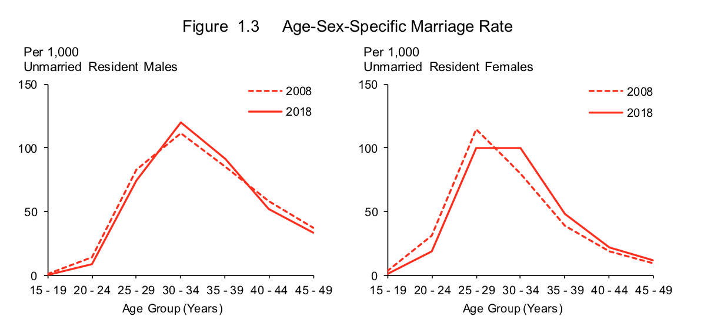
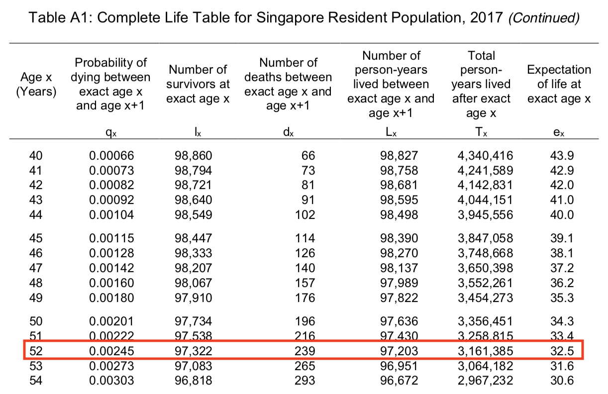

# Measuring societal change {#apc}

```
Contributor: Shannon Ang
Date: 17 September 2019
```

We hear various statistics that imply social change all the time. For instance, we hear that [suicides are rising in Singapore](https://www.channelnewsasia.com/news/singapore/suicides-number-2018-teenagers-boys-highest-11761480){target="_blank"}, or that [Singaporeans are living longer](https://www.todayonline.com/singapore/singaporeans-living-longer-spending-greater-proportion-time-ill-health-study){target="_blank"}, or that the [number of babies born is declining](https://www.channelnewsasia.com/news/singapore/number-of-babies-born-in-singapore-falls-to-lowest-in-8-years-11743722){target="_blank"}. 

As always, people have many comments and theories about reasons behind what is happening. But before we can evaluate these comments, we need to first understand - what do these numbers really mean, and what kind of change is it really capturing? This case study looks at several ways we talk about societal change in public, and provides a better understanding of these commonly used numbers for higher quality discourse.

## Three ways to understand change
Before we evaluate real examples, it will be helpful to understand different kinds of societal change. Let us work with a toy example. Suppose the newspaper (your favourite one) headline tomorrow states: "Average walking speed of Singaporeans slower than 10 years ago". There are three possible explanations for this (maybe more, this is not a perfect analogy).

1. Older people walk slower, and Singapore is an ageing society (average age is rising), so its average walking speed will fall as there are more older people in society.

2. Those born later (e.g., Millenials, Gen Z) are walking slower than those born earlier (e.g., Baby Boomers), bringing down our average walking speed.

3. There was an alien invasion this year and many aliens suddenly came to live among us. This suddenly caused overpopulation, since our system [is only prepared for 6.9 million](https://www.strategygroup.gov.sg/media-centre/population-white-paper-a-sustainable-population-for-a-dynamic-singapore){target="_blank"}. People in Singapore thus have to lower their walking speed this year because it has become very crowded compared to last year.

The last one is slightly facetious, but as you can see, the three explanations point to three **quite different** reasons for change. We will look at each one, in order.

1. Change with **age**: Age effects refer to changes over the life course that apply to all individuals as they grow older. This is best demonstrated in terms of physical and biological changes that occur as we age (e.g., our metabolism slows down, we get wrinkles etc.) - such changes tend to be common to all of us, regardless of when we were born, or what era we live in.

2. Change with **cohort**: Cohort effects are probably easiest to think about as *generational* change (i.e., change with *birth* cohorts), even though more generally they are used refer to a group of individuals that have gone through shared experiences (e.g., school cohorts). When you hear remarks like "*young people nowadays* are [such strawberries / so spoilt / have no manners]", this is usually the kind of change people they are suggesting has happened.

3. Change with **period**: Period effects are changes due to contextual factors that affect all living persons at a particular point in time. For instance, significant events such as wars, epidemics, or natural disasters affect everyone who is exposed to it regardless of age.

Social scientists have long recognized the need to think clearly about these three distinct ways of understanding social change^[Although there is an equally long-running debate about how to estimate these effects, given linear dependence between the terms, i.e. $Cohort = Period - Age$. See @fosse_analyzing_2019 for a great discussion.]. Popular discourse, however, tends to ignore the meaningful differences between these concepts - a common error is making conclusions about cohort change based off period data. We will examine two instances of this.

## Declines in marriage and divorce {#marriage-decline}

Marriage has been a key preoccupation of the Singapore government for many reasons (e.g., increasing fertility rates, shaping housing policy). Trends in marriage/divorce/fertility are thus often closely watched. The Straits Times recently published this article on marriage/divorce rates in 2018.

<br>
```{r st-apcmarriage, fig.cap='Screenshot of online article on marriage rates. Retrieved September 17, 2019.', out.width='80%', fig.align='center', echo=F}

```
<br>

The article is based on [a report](https://www.singstat.gov.sg/-/media/files/publications/population/smd2018.pdf){target="_blank"} on Marriages and Divorces, produced by the Department of Statistics^[We will focus on discussing non-Muslim marriages here, but the same principles can be applied to Muslim marriages as well.]. Among other things, the article states: 

<br>

> A total of 27,007 marriages were registered last year - the lowest in five years and 4.3 per cent fewer than the 28,212 marriages registered in 2017.
>
> ... Meanwhile, 7,344 marriages ended in a divorce or annulment last year, a 3.1 per cent drop from the 7,578 marital dissolutions in 2017.
>
> ... Given the volatile economy, observers said financial considerations could have contributed to the falling number of marriages and divorces last year.

<br>

Now, given that we've talked about age, cohort, and period changes, one question that should come to mind is: *what kind of measure is this?* Well, this is a **period measure** - it records the number of marriages in a certain year. Unnamed 'observers' cited by the article seem to understand this. They point out that the economy last year may have had a part to play, which is a plausible reason for period changes that suits the nature of the measure^[The general marriage rate, which is adjusted for population size of unmarried residents aged 15-49, also seems to tell this story.]. However, often times, people provide *cohort* explanations for changes in *period* measures.

The next two subsections will look at the question - **How reasonable is it to adopt *cohort* explanations for changes in *period* measures of marriage?**

<br>

### Evaluating explanation 1

We first take a look at the following paragraph on changes in median age at first marriage:

<br>

> The median age at first marriage for grooms rose from 29.8 years in 2008 to 30.2 years last year, while for brides, it went up from 27.3 years in 2008 to 28.5 years last year.
>
> This is because more people spend a longer time getting an education and building up their careers before they settle down, said National University of Singapore sociologist Tan Ern Ser.
  
<br>

Note here that median age at marriage is, once again, a **period measure** - of all people who got married that year, half of them got married before age 28.5. 

NUS sociologist Tan Ern Ser says that the median age at first marriage is rising because "people" spend more time in education and early-career building before they "settle down" (i.e., get married). But who are these "people", exactly? Since most members of older cohorts do not usually go back into education and early-career building, there seems to be an implicit reference to younger cohorts (or, in layman terms, *"people nowadays"*)^[Of course, there is now a great drive towards lifelong learning and mid-career switches, but in the context I think it is reasonable to assume this is not the group of people being referred to.]. 

**How do we evaluate whether this explanation is reasonable?** I advocate taking **two steps**:

1. Figure out if trends observed reflect cohort change, rather than age or period change. 
2. Figure out if the explanation given for cohort change is supported by evidence.

Frustratingly, marriage statistics by cohort are not available from the government, so we cannot directly assess whether trends are really due to cohort change. The reason why period measures are used is often a matter of practicality (as we will discuss in the next section), but in other countries, academics use longitudinal panel survey data to estimate and project what might happen in younger cohorts. In Singapore, such survey data is scant and/or tend not to be shared with researchers outside of the government. This makes cohort change especially difficult to study. **But we will work with what available data we can find.** 

<br>

**Step 1**

For a start, let us try to do Step 1 and make sure that changes in period measures are *not* due to the changing population age structure (i.e. age effects). Age-specific marriage rates are adjusted for the size of age groups and give us a picture of period change that is not driven by changes in age composition. They are thus very helpful here, and have been provided in [the report](https://www.singstat.gov.sg/-/media/files/publications/population/smd2018.pdf){target="_blank"} on Marriages and Divorces by the Department of Statistics, where we find Figure \@ref(fig:apc-reportsingstat).

<br>
```{r apc-reportsingstat, fig.cap='Screenshot from Department of Statistics report titled "Statistics on Marriages and Divorces,  2018". Retrieved September 17, 2019.', out.width='80%', fig.align='center', echo=F}

```
<br>

You can see that the mountain-like shape in Figure \@ref(fig:apc-reportsingstat) is moving to the right, telling us that in 2018, the marriage rate is lower among younger age groups (15-29) and higher among older age group (30+), compared to 2008. **The figure thus suggests that people are getting married at later ages, and this is not just because our population as a whole is getting older**. The combination of age and period data suggest that the presence cohort change remains plausible (Step 1).

<br>

**Step 2**

Step 2 is to verify the cohort explanation itself. NUS sociologist Tan Ern Ser says that younger cohorts are delaying marriage in view of education and career building, so we should check that younger cohorts are indeed spending longer in education/early-career. The Ministry of Education happens to provide us data on Primary 1 cohorts (i.e., people who attended Primary 1 in the same year are in the same cohort), which tend to approximate birth cohorts closely (Figure \@ref(fig:apc-reportmoe)).

<br>
```{r apc-reportmoe, fig.cap='Screenshot from Data.gov.sg on "Percentage of P1 Cohort that Progressed to Post-Secondary Education". Retrieved September 17, 2019.', out.width='80%', fig.align='center', echo=F}
knitr::include_graphics("images/apc/apc_moe.png")
```
<br>

The chart above shows that younger cohorts are indeed spending longer in education, since a larger percentage of them end up in post-secondary courses overall (see the rising trend across years). It does seem like younger cohorts are spending more time in education, so the cohort explanation therefore seems reasonable *up to this point.* 

At the same time, however, note that [the report](https://www.singstat.gov.sg/-/media/files/publications/population/smd2018.pdf){target="_blank"} by the Department of Statistics states the following on page 7:
 
<br>

> Between 2008 and 2018, the median age at first marriage among brides with secondary and below qualification rose considerably, narrowing the gap with graduate brides. For grooms, the differences in median age at first marriage across the educational groups also diminished over the same period.

<br>

This considerably undermines NUS sociologist Tan's explanation that younger cohorts are delaying marriage in view of education and early career building, since it seems that even though younger cohorts *are* getting more education, median age of marriage is rising **even among those without** post-secondary education (and at a faster rate than those more highly educated). We have not considered the "early career building" part yet, but it shows that this explanation requires more work to validate.

<br>

### Evaluating explanation 2

Let us now look at another comment that was made about marriage rates. The news article states:

<br>

> ...Singapore Management University professor of sociology (practice) Paulin Straughan said they also seem to be spending a longer time looking for the right partner. She said: "People believe that marriage is forever and unless they are very sure they have found a life partner, they wouldn't marry."

<br>

SMU Professor (Practice) Paulin Straughan surmises that median age at first marriage is rising because "people" wait to be very sure of their partner. While there may be some kernel of truth here (although no data is provided to support her point), it is quite unclear what she really means by this. Is she saying that everyone is delaying marriage because Singaporean culture has changed over time and people across all generations are now more careful about who to marry compared to the past^[Think about what this really means though. How possible is it to observe this?] (i.e., a period effect)? Or is she saying that younger cohorts are now more careful about who to marry (i.e. a cohort effect)?

Regardless of whether we think it is a period or cohort explanation, a natural follow-up question would be - does this also explain the reason why divorce rates are falling (as the news article headline states)? If the 'waiting to be very sure' explanation holds weight, it should follow that since people have become more careful to marry, marriages are probably less likely to end up in divorce^[It could also be that *even though* people are more careful, they still make choices that end up in divorce, but this is somewhat an awkward assumption to make given a plain reading of the comment.]! People "waiting longer" also would then explain why divorce numbers are falling. 

*Suppose we adopt the following explanation*: **Divorce numbers are falling because younger cohorts are more careful (and therefore taking longer) about choosing their partners**^[This is not what SMU Professor (Practice) Paulin Straughan explicitly said, but something that we have inferred for heuristic purposes, after making several assumptions about carefulness in partner choice and stability of marriages.].

Remember that the divorce numbers mentioned in the news article are a **period** measure^[You may also ask, since we're dealing with absolute numbers, isn't it obvious that if there are less marriages, then there would be less divorces too? This is why absolute numbers are seldom helpful when examining societal change. At a minimum, we should attempt to look for rates that are adjusted for the size of the group at risk.]. Just like median age of marriage, the median age at divorce is also rising, according to [the report](https://www.singstat.gov.sg/-/media/files/publications/population/smd2018.pdf){target="_blank"} by the Department of Statistics, which states on page 15:

<br>

> With an ageing population and rising divorce rates for older persons, the proportion of divorcees aged 45 years & over rose from 32.7 per cent in 2008 to 44.0 per cent in 2018 for males, and from 21.7 per cent to 29.9 per cent for females. As a result, the median age at divorce rose over the last decade."

<br>

*Also remember the 2 steps outlined in the previous sub-section*:

1. Figure out if trends observed reflect cohort change, rather than age or period change. 
2. Figure out if the explanation given for cohort change is supported by evidence.

<br>

**Step 1**

The quote above already hints at trends being driven by age composition ("ageing population"), and period trends^[For those more technically oriented, @martin_comment:_2009 has an intriguing discussion about age*period interactions masquerading as cohort effects.] ("rising divorce rates for older persons"). This already tells us the government believes the period trend is unlikely to be driven by cohort change. However, we still can look at age-specific rates to replicate what we did earlier with marriage figures (Figure \@ref(fig:apc-reportsingstat2nd)). 

<br>
```{r apc-reportsingstat2nd, fig.cap='Screenshot from Department of Statistics report titled "Statistics on Marriages and Divorces,  2018". Retrieved September 17, 2019.', out.width='80%', fig.align='center', echo=F}
knitr::include_graphics("images/apc/report_fig3.png")
```
<br>

Once again we see from Figure \@ref(fig:apc-reportsingstat2nd) that in 2018, divorce rates are lower among younger age groups (15-29) and higher in older age groups (30+), compared to 2008. This is the same situation as before (with marriage numbers), and there we temporarily concluded cohort change is possible, though not certain. So why does the Department of Statistics not connect period trends with cohort change?

Data on divorce trends by birth cohort are (again) not available, but all is not lost. Weirdly enough, there exists some information on divorce by "marriage cohorts" (where each cohort is defined by the year they got married - i.e., if you got married in the same year as I did, you are in my marriage cohort) in a report by the Ministry of Social and Family Development (found [here](https://www.msf.gov.sg/research-and-data/Research-and-Data-Series/Pages/default.aspx){target="_blank"}). What kind of change marriage cohort trends really capture is quite hard to say, but for heuristic purposes we may assume they (very) roughly approximate^[Think about who gets married in a certain year. What kind of people are they composed of? What characteristics do they share? It is hard to say. Other than sharing the same year of marriage, diversity within marriage cohorts is likely to be huge. We can only assume that younger birth cohorts will dominate most of the marriages in later years, but it remains to be seen whether this is accurate.] birth cohort trends. Figure \@ref(fig:apc-reportmsf) shows us the proportion of divorces (y-axis) that happen before the couples' $x^{th}$ anniversary (shown on the x-axis), by marriage cohort (indicated by the color and shape of the lines).

<br>
```{r apc-reportmsf, fig.cap='Screenshot from Ministry of Social and Family Developent report titled "Dissolutions of Marriages Among Marriage Cohorts, 1987-2015". Retrieved September 17, 2019.', out.width='80%', fig.align='center', echo=F}
knitr::include_graphics("images/apc/report_fig2.png")
```
<br>

What can be observed from Figure \@ref(fig:apc-reportmsf) is that **younger (marriage) cohorts seem to be getting divorced earlier**^[It remains to be seen if lifetime divorce rates will be higher, since we cannot yet observe the full trajectory of union dissolutions for the younger cohorts (or even for older cohorts, since not all of them have disolved their union or passed away).]. For instance, you may notice that a higher proportion of those married in 2011 (light pink line) dissolve their unions before their 5th anniversary compared to those married in 2001 (dark pink line) or earlier^[Note that this does not really line up with the 2018 and 2008 measures we were comparing before, but there really is no easy way to do this.]. 

The picture painted here seems more bleak^[Assuming divorce is always a bad thing, which may not always be the case. A rise in divorce rates may possibly reflect changes in power dynamics within couples, with women becoming more independent and more willing to leave abusive situations.] compared to what we expected from period trends (and the news article). While period trends seemed to suggest that people were getting more careful with partner selection (since divorce rates were falling overall and median age of marriage and divorce has increased), **cohort trends seem to be telling the opposite story - younger cohorts seem to be getting divorced earlier into their marriages!** 

<br>

**Step 2**

The cohort explanation we adopted for this section was that "Divorce numbers are falling because younger cohorts are more careful about choosing their partners". We have already found, however, younger cohorts (albeit on marriage cohorts, not birth cohorts) are in fact getting divorced earlier. This directly contradicts the cohort-based explanation.

What is key here is to note that **while period measures and cohort measures can sometimes tell similar stories about societal change, there are many times when they do not.** When we say "marriages and divorces are falling", we need to be clear what the data allows us to say, and what kinds of explanations we give. If cohort trends are not the same as period trends, than providing cohort explanations for period change becomes meaningless.

We must therefore be very careful how we make claims about societal change, and what data we use to back it up. In the next section, we will look at life expectancy - a highly misunderstood measure in popular discourse.

## Living longer than you expect 

We've heard this so many times - "life expectancy is increasing". "Singapore has one of the highest life expectancies in the world." **But what does the term "life expectancy" mean?** 

<br>
```{r apc-lifeexp, fig.cap='Screenshot of online article on life expectancy. Retrieved September 17, 2019.', out.width='80%', fig.align='center', echo=F}
knitr::include_graphics("images/apc/apc_lifeexpectancy.png")
```
<br>

A typical article (such as [this one](https://www.healthxchange.sg/seniors/healthy-ageing/why-singaporeans-living-longer){target="_blank"} written by a physician) will use estimates of life expectancy to say, for instance, "Singaporean residents can expect to live up to 83.2 years^[The figure for the year 2017.]". This reading of life expectancy is quite common.

The obvious question here is - Who can expect to live up to 83.2 years? My grandma? Me? My child? Do all Singaporeans now expect to live to the same age^[If this is true, then if life expectancy increases faster than one year annually, does this mean we can all expect to be immortal? You can see how ludicrous this sounds.]?

The figure most often cited in the media is life expectancy *at birth*. A more precise way to interpret the life expectancy in 2017 is "Singaporean residents **who are born in 2017** can expect to live to 83.2". [This other news article in the Straits Times](https://www.straitstimes.com/singapore/health/singapore-tops-in-life-expectancy-at-848-years){target="_blank"} rightly refers to the life expectancy estimate as "expected lifespan at birth".

**But this still does not fully capture how life expectancy is calculated.** To do this, we need to go back to our understanding of age, period, and cohort measures. Life expectancy, as it is reported yearly, is a **period measure**. 

Without going into full detail (interested readers can refer to resources such as [this](https://www.measureevaluation.org/resources/training/online-courses-and-resources/non-certificate-courses-and-mini-tutorials/multiple-decrement-life-tables/lesson-3){target="_blank"}), I will explain briefly how this is calculated. A typical life table from the Department of Statistics (taken from [this report](https://www.singstat.gov.sg/-/media/files/publications/population/lifetable17-18.pdf){target="_blank"}) looks like Figure \@ref(fig:apc-lifetable) (it shows just the top part, the entire table is a few pages long).

<br>
```{r apc-lifetable, fig.cap='Screenshot of Complete Life Table from the Department of Statistics. Retrieved September 17, 2019.', out.width='80%', fig.align='center', echo=F}
knitr::include_graphics("images/apc/apc_lifetable.png")
```
<br>

1. Age-specific mortality rates (not pictured, but often referred to as $m_x$) for a specific year are obtained from the national mortality database and turned into^[Some assumptions need to be made here about a quantity called $a_x$, which captures when most deaths in a certain age-interval happen within the time period, but usually this calculation is straightforward.] the probability of dying in a specific age-interval ($q_x$, pictured). 

2. You start with a hypothetical base population, usually 100,000, and you put them through the mortality rates of each age until there are no more survivors ($l_x$). In other words, the probability of dying at an age-interval becomes certain ($q_x = 1$) at some point (usually 100+) since no one is immortal.

3. From there, you calculate a number of other things (e.g., $d_x$, $L_x$, $T_x$, using simple math formulas). These numbers then help you derive the life expectancy (basically, $e_x = \frac{T_x}{l_X}$).

You may not yet fully understand what is happening here, but just note one key thing - the key quantities here that affect everything else in the whole process are the age-specific mortality rates ($m_x$). And these age-specific mortality rates used in calculating life expectancy are a **period** measure, which capture what is happening *that particular year*.

To understand what this means for how we interpret life expectancy, we return to our previous interpretation - that "Singaporean residents **who are born in 2017** can expect to live to 83.2". 

Let's now make it more precise and say that "Singaporean residents **who are born in 2017** _**and who are exposed to mortality rates of 2017 throughout their lives**_ can expect to live to 83.2". 

This sounds highly awkward, I know. You would have to imagine some kind of time machine allowing you to stay stuck in 2017, continuing to experience its mortality rates even as you grow older. But it is in fact how the measure is calculated. **Life expectancy, as often cited in the media, is a period measure that is constructed by stitching together the experiences of multiple cohorts** (often called a *synthetic cohort*).

A more intuitive measure of life expectancy is called **cohort life expectancy**. Cohort life expectancy follows every person who was born in a certain year (e.g., 1965), and is calculated using the observed/projected rates of all persons in that cohort. With cohort life expectancy, we can truly say that "Singaporean residents born in year XXXX live XX.X years on average". So why don't we do this? The answer is simple - to obtain observed rates, we need to observe these deaths for each cohort! We would therefore need to wait for all (or most^[Using a mixture of observed and projected rates is possible.]) of each cohort to pass away before we can calculate such numbers.

Period life expectancy is therefore practical to use as a measure of how well our health system is doing from year to year, but we must acknowledge its limitations. In order to examine how volatile period rates of life expectancy can be, we can simply look at older rates of life expectancy. 

*But first, a small excursus* - if you look back at Figure \@ref(fig:apc-lifetable), one thing you will realize is that there are life expectancy estimates for each age. Therefore, life expectancy at age 40 is not the same as life expectancy at birth, and they do not usually add up (i.e., Life expectancy at 40 $\neq$ Life expectancy at birth - 40). Knowing this, we can now do a little thought experiment with life expectancy estimates.

Let us now look at life expectancy at birth in the year 1965. Using the Department of Statistics Table Builder (go [here](https://www.tablebuilder.singstat.gov.sg/publicfacing/createDataTable.action?refId=13276){target="_blank"}) to retrieve the data, it seems life expectancy at birth for Singapore residents back in 1965 was 64.5. Using the common way of interpreting these data, we might say, "we can expect those born in 1965 to live up to 64.5 years old."

Fast forward to 2017, and those born in 1965 are now 52 years old. If those numbers in 1965 are correct, it follows that we might expect life expectancy at 52 to be $64.5 - 52 = 12.3$ years. Let's go back to the [Complete Life Tables](https://www.singstat.gov.sg/-/media/files/publications/population/lifetable17-18.pdf){target="_blank"} we were looking at before to see how long more those born in 1965 can expect to live (Figure \@ref(fig:apc-lifetabletwo)).

<br>
```{r apc-lifetabletwo, fig.cap='Screenshot of Complete Life Table from the Department of Statistics. Retrieved September 17, 2019.', out.width='80%', fig.align='center', echo=F}

```
<br>

Wait. We see now that those who aged 52 in 2017 can in fact expect to live 32.5 more years. That means they are expected to live up to $52 + 32.5 = 84.5$ years old! That seems way different from the 64.5 years projected by mortality statistics in 1965. Why is this so? This is because period life expectancy does not account for future improvements in mortality driven by better healthcare, hygiene, health behaviors etc. Period life expectancy is therefore often an *underestimate* of the true cohort life expectancy^[Unless mortality rates spike due to events such as wars, famines etc.]. The discrepancy we see between the 1965 life table and the 2017 life table is likely due to great improvements in mortality rates since independence.

Having studied how life expectancy 'works', let us conclude by evaluating this paragraph from an article on the [Dollars and Sense website](https://dollarsandsense.sg/retirement-planning-singapore-live-beyond-average-life-expectancy/){target="_blank"}, aimed at helping Singaporeans plan their retirement:

<br>

> The next step of the retirement planning equation is to understand how long we can expect to spend in retirement. The longer we spend in retirement, the more we need to sustain ourselves.
>
> **How Long Do We Spend In Retirement?**
The simplest way to derive this figure is to use the average life expectancy of Singaporeans – which stands at  83.1 years today. This figure is only going to go up as the latest report from the World Health Organisation (WHO) revealed that people here can expect to live up to 85.4 years by 2040.
>
> What this tells us is that if we retire at the moment we are able to receive our CPF LIFE payouts – at 65 – and live to the average life expectancy in Singapore – to 83.1 – we will have close to 18 years of retirement.

<br>

**What are the misinterpretations of life expectancy present here?** First, the writer talks about average life expectancy as if it applies to everyone. As we discussed, however, the number he uses likely reflects the life expectancy *at birth*. Is he speaking to newborns and asking them to plan for retirement? A better approach would be to go to the [Complete Life Tables](https://www.singstat.gov.sg/-/media/files/publications/population/lifetable17-18.pdf){target="_blank"} published by the Department of Statistics and refer to life expectancy at 50 (or some other reference age that his target audience can identify with). Second, he is correct that life expectancy will probably continue to rise, but the 18 years (obtained supposedly using $83.1 - 65 \approx 18$) is likely an underestimate of how long "retirement" will be (apart from the error already made in the first point). Plan harder, people.

## Conclusion

Age, period, and cohort effects are important ways to understand changes in society over time. People most commonly mix up period and cohort effects, such as offering cohort explanations for changes in period measures, or mistaking one kind of change for the other. In many cases, period and cohort rates tell the same overall story. Where they tend to diverge is when there are large societal changes within short periods of time (like in Singapore), as we have seen in the case of life expectancy. Under such circumstances, period measures are usually bad estimates of cohort change. 

We often assume that experts and social scientists quoted in newspapers are making statements about societal change based off empirical evidence and research that they have done. But sometimes experts may just be speculating about something there is no real data to show for (e.g., no cohort data, and no research done to project cohort trends). In such a case (and with the application of some common sense), anyone's speculation may be as good as theirs. Where these speculations happily coincide with reality they may be of some use, but readers should carefully evaluate whether it is suitable for certain numbers to be used to make certain points.

