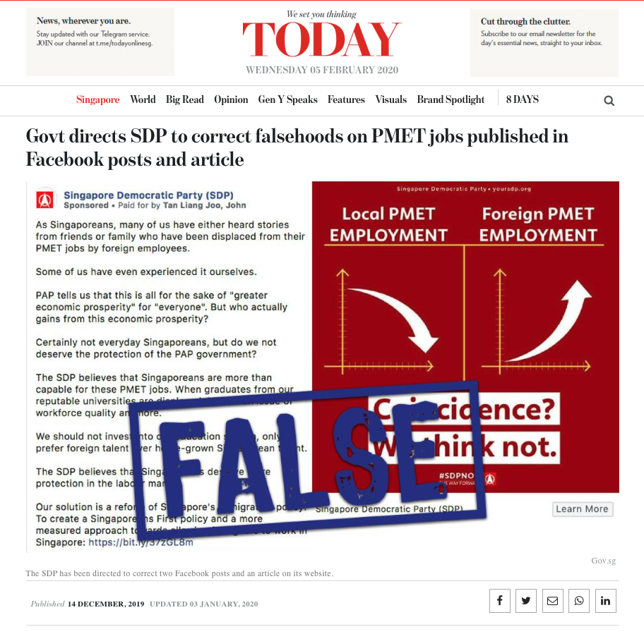

# You say; I say; Who confirm? {#yousayisay}

```
Contributor: Shannon Ang
Date: 06 February 2020
```

People argue about how to interpret statistics. Often, parties quickly resort to inflammatory language and mudslinging in public, accusing others of being "disingenuous" and "dishonest". A dichotomy is typically drawn - essentially, "my" interpretation is absolutely correct and you are "manipulating the numbers". There are indeed cases where this can be a legitimate claim, such as erroneously interpreting a conditional probability as a total probability (see Chapter \@ref(ooptech)). But most cases are not so clear cut, and cannot be reduced to errors of technicality. 

The interpretation of statistics is not context-free - this means that some ways of looking at numbers support certain arguments better than others. Both statistical rigour and domain expertise are needed to draw a strong link between evidence and conclusion. Simply drawing a dichotomy and taking an adversarial approach is very unhelpful when the disagreement is about what certain statistics tell us about larger phenomena (e.g., earth is getting warmer, people have more liberal attitudes). 

In this case study, we will look at two very public cases of disagreements around statistics. I will suggest some ways in which we can move past the (unnecessarily) incendiary language being used, and ask the questions that really matter.

## SDP vs. MOM {#pofmasdp}

In an application of the Protection from Online Falsehoods and Manipulation Act (POFMA), sitting Minister for Manpower Josephine Teo issued three correction directions against the Singapore Democratic Party (SDP)^[A local political opposition party.] for propagating online falsehoods. The SDP appealed against the order, and eventually lost in the High Court (see [related news article](https://www.channelnewsasia.com/news/singapore/judge-dismisses-sdp-s-pofma-challenge-says-statements-were-false-12394932){target="_blank"}).

<br>
```{r today-sdp, fig.cap="Screenshot of online article on MOM's correction directive. Retrieved February 5, 2020.", out.width='80%', fig.align='center', echo=F}

```
<br>

The point of this case study is not to say whose legal case was made out, which the court has already ruled on^[Note that Minister for Law Shanmugam said the following [in Parliament on 15 August 2016](https://sprs.parl.gov.sg/search/fullreport?sittingdate=15-08-2016){target="_blank"}: "Academics or media outlets publish commentaries on a judge's decision, even where an appeal is pending. These are not prohibited. Commenting on a judge's reasoning is unlikely to pose a real risk of prejudicing the appeal outcome. We have not changed the law. Such commentaries are allowed today. If the Bill gets passed, they will continue to be allowed under the Act."]. Rather, I will focus on one specific portion of the case, and highlight how we can ask better questions and demand better arguments from people who use statistics. 

We will look at the first correction direction (CD-1), related to one of SDP's earlier articles (found [here](https://yoursdp.org/news/sdp_population_policy_hire_s_39_poreans_first_retrench_s_39_poreans_last){target="_blank"}). The point we will examine here is aptly described in the [government's Factually article](https://www.gov.sg/article/factually-corrections-on-falsehoods-posted-by-sdp){target="_blank"}^[Justice Ang Cheng Hock ultimately decided that the facts provided by Factually were not directly relevant to this proported falsehood, because it was not fair to interpret SDP's statement on *proportions* as applying to *absolute numbers* (*Singapore Democratic Party v Attorney-General* [2020] SGHC 25 in [80] and [92]). He did, however, consider the arguments made on the grounds of absolute numbers, which we will also consider here.]:

<br>

> **Falsehood #2 - The claim that Singaporean PMET retrenchment has been going up.** 
> The SDP website states that the party’s “proposal comes amidst a rising proportion of Singaporean PMETs getting retrenched”. This statement is false.
>
> **Fact #2a**: There has been no rising trend of local retrenchments since 2015.
>
> **Fact #2b**: There has been no rising trend of local PMET retrenchment since 2015. The number of retrenched local PMETs has declined from 6,460 in 2015 to 5,360 in 2018, the lowest since 2014.

<br>

In response, the SDP provided [their own take on the Ministry's figures](https://yoursdp.org/news/sdp-calls-on-josephine-teo-to-retract-correction-directions-and-apologise,-cites-mom's-own-statistics-to-prove-she's-wrong#site-menu){target="_blank"}, and showed an overall increasing linear trend from 2010 to 2018. To bypass all this truncation of data, I decided to just plot all the data available. For numbers of *all* retrenchments (including locals and foreigners), you can find the figures I used from [here](https://stats.mom.gov.sg/Pages/RetrenchmentTimeSeries.aspx){target="_blank"}. For numbers of *local* retrenchment, I got them by directly emailing the Manpower Research and Statistics Department at the Ministry of Manpower (MOM)^[Instead of giving me the absolute numbers for local PMET retrenchment, however, MOM gave me the total local retrenchment, and the proportion of PMETs among those. To get absolute numbers for local PMET retrenchments, I multiplied the total retrenchment by the proportion of PMETs. There may be some small amounts of error due to rounding, but this doesn't influence the overall picture.]. 

<br>
```{r ysis-retrenchrate, fig.cap='Chart of retrenchment rate over time', out.width='100%', fig.align='center', echo=FALSE, fig.height=5, fig.width=8}
library(ggplot2)
library(grid)
library(gridExtra)
data <- read.csv("files/retrenchment_all.csv")
p1 <- ggplot(data, aes(x=year)) + 
  geom_line(aes(y=number/1000, col="All")) +
  geom_line(aes(y=number_local/1000, col="Local")) +
  theme(legend.title = element_blank(),
        plot.caption = element_text(hjust=0),
        legend.position = c(0.94,0.12)) +
  scale_color_manual("", 
                     breaks = c("All", "Local"), 
                     values = c("All"="steelblue4", "Local"="darkorange1")) +
  scale_x_continuous(breaks=seq(1998, 2018, 2)) +
  scale_y_continuous(breaks=seq(0,15,3)) +
  labs(x = "Year", 
       y = element_blank(),
       title="Number of PMET Retrenchments (in Thousands)",
       caption="Source: Labour Market Survey, Manpower Research & Statistics Department, MOM \nNote: Before 2006, data pertain to private sector establishments each with at least 25 employees. \n         From 2006 onwards, it also includes the public sector.\n") +
  geom_vline(xintercept=2016, linetype="dotted", col='red4') +
    annotate("text", x = 2016.2, y = 15, label = "Recession?", 
           hjust=0, col='red4', size=3) +
  annotate(geom="rect", xmin=2008, xmax=2009, ymin=-Inf, ymax=Inf, alpha=0.4, fill="red4") +
  annotate("text", x = 2008, y = 14, label = "Great Recession \n(2008-09) ", 
           hjust=1, col='red4', size=3) +
  annotate(geom="rect", xmin=2001, xmax=2002, ymin=-Inf, ymax=Inf, alpha=0.4, fill="red4") +
  annotate("text", x = 2002.1, y = 14, label = "Recession \nin Singapore \n(2001) ", 
           hjust=0, col='red4', size=3) +
  annotate(geom="rect", xmin=-Inf, xmax=1998, ymin=-Inf, ymax=Inf, alpha=0.4, fill="red4") +
  annotate("text", x = 1998.1, y = 14, label = "Asian financial \ncrisis (1997-98)", 
           hjust=0, col='red4', size=3) +
  annotate(geom="rect", xmin=2015, xmax=Inf, ymin=-Inf, ymax=13, alpha=0.3) +
  annotate("text", x = 2015.2, y = 12, label = "Period covered \nby MOM", hjust=0, col='black', size=3.5) +
  annotate(geom="rect", xmin=2010, xmax=Inf, ymin=-Inf, ymax=14, alpha=0.18) +
  annotate("text", x = 2010.2, y = 13.5, label = "Period covered by SDP", hjust=0, col='black', size=3.5) 
p1
```
<br>

As we can see from the figure, there are vastly different trends depending on where you want to start from and how long of a trend you want to track. I have highlighted (in grey and dark grey) the portions that were used by SDP and MOM respectively. If you look across the whole figure, you will naturally find that in some parts of the graph the trend is increasing, and in other parts the trend is decreasing^[You can also find that as the Factually article states, the proportion of local PMET retrenchments among all PMET retrenchments is decreasing.]. But does this mean that choosing a starting point from *anywhere* is arbitrary? Based on my reading of his judgement, Justice Ang Cheng Hock seems to suggest this:

<br>

> Third, even if one takes the appellant’s [i.e., SDP] case at its highest and relies on the data from 2010 to 2018, it bears note that the appellant’s reference to 2010 as a starting point is somewhat arbitrary. **Understandably, any timeframe may, to some extent, be criticised as being arbitrarily selected.** However, the appellant’s own reasoning could warrant a starting point of 2009, or even 2008. **Using 2009 as a starting point would show an overall decrease in unemployed local PMETs from 2009 to 2018, and this illustrates how using 2010 as a starting point is itself quite arbitrary.**
>
> *Singapore Democratic Party v Attorney-General* [2020] SGHC 25 in [96], *emphasis mine*

<br>

I would respectfully disagree with Justice Ang's reasoning here^[Even though he qualifies these statements with "somewhat" and "to some extent".], if he is implying that any kind of starting point can be criticized as being *equally* arbitrary. In my view, it is possible to discriminate between worse and better time frames/trends to look at. I provide **two reasons** how this is so:

<br>

1. **The length of trends matter** 

Long-term trends and short-term trends may move in different directions, but parties should be expected to justify *why* looking at either type of trend is more relevant to the argument they are trying to make. This kind of justification should go beyond what the "reasonable person's" default time frame is when reading an/any article, and look instead at exactly what sort of argument is being made (i.e., the topic at hand) to decide if long or short term trends are in view. **While it may seem like people commonly have only "the most recent" trends in mind, there are instances when people naturally think about long term trends. It is easy to see why this is the case with some practical examples.**

One relevant example would be investing in the stock market. Many investors (or financial advisors) use this adage: "It's all about time in the market, not timing the market". Essentially, what this suggests is that in the short term, the value of products such as exchange traded funds (ETFs) will fluctuate up or down, but in the long term (5-10+ years) it will generally appreciate. Go [here](https://www2.sgx.com/indices/products/sti){target="_blank"} and play around with it to see how trends change depending on the time frame you pick. Most Singaporeans who have some form of financial literacy will understand this, and naturally think long-term trends when ETFs are talked about.

Another example is climate change. Scientists have pointed out [again](https://www.huffpost.com/entry/nate-silver-climate-change_b_1909482){target="_blank"} and [again](http://www.realclimate.org/index.php/archives/2008/01/uncertainty-noise-and-the-art-of-model-data-comparison/){target="_blank"} that tracking short-term trends in temperature *cannot* tell us much about long-term global climate change. In [one article](http://www.realclimate.org/index.php/archives/2008/01/uncertainty-noise-and-the-art-of-model-data-comparison/){target="_blank"}, the researchers note that we only start to see meaningful patterns when you look at 15-year averaged trends! Any argument made about climate change therefore needs to address long-term changes (e.g., how has the temperature changed in the past decade), not just short-term ones (e.g., how has the temperature changed from 2-3 years ago).

**There are different benefits to thinking about long and short term trends.** Long term trends are less susceptible to fluctuations due to random variation, and can provide a clearer picture of trends that short-term trends cannot detect (e.g., climate change). On the other hand, short term trends can alert us if something unusual is happening, e.g., a spike in flu-like symptoms may signal a virus spreading, or an increase in rural-urban migration rates in China may signal it is time for Chinese New Year. 

My point, therefore, is this - there are good arguments to be made for whether a longer or shorter time-frame should be used. They are not *equally* arbitrary. **Parties who are trying to make their arguments based on these choices (i.e., short or long term) should justify these choices, because it matters substantively.**

<br>

2. **Not all start/end points are made equal**:

Just as there are arguments to be made for longer or shorter trends, there are also arguments to be made for what are good "starting points" to use. In Figure \@ref(fig:ysis-retrenchrate) above, I **highlighted in red** the times when Singapore was facing a recession. As one would naturally conclude from the figure, there are spikes in retrenchment when a recession occurs. A "spike" here simply means that there is a rapid increase, and then a rapid decrease in the numbers, usually due to a exogenous (or endogenous) shock to the usual course of affairs^[Our Ministers have been very consistent in pointing out that Singapore's economy is highly dependent on the global economy, so assuming recessions are usually exogenous may not be too far off the mark].

The question to ask is this - **how meaningful is it to interpret (whether as a result of policy or not) the increase in retrenchments before a recession, or the decrease in retrenchments after a recession?** I believe it would raise a red flag if someone decided to use data from 2007-2009 to show that retrenchments have increased, or to use data from 2009-2010 to show a decline. I requote from the judgement here:

<br>

> Using 2009 as a starting point would show an overall decrease in unemployed local PMETs from 2009 to 2018, and this illustrates how using 2010 as a starting point is itself quite arbitrary.
>
> *Singapore Democratic Party v Attorney-General* [2020] SGHC 25 in [96]

<br>

I would respectfully disagree with Justice Ang here. **Using 2009 to illustrate the arbitrariness of using 2010 as a starting point is, in my view, not a fair comparison. This is because 2009 was the peak of the Great Recession in Singapore, and retrenchments are much more inclined to fall after a recession ends (somewhat of a "regression to the mean" phenomena).** To say that retrenchment has decreased since 2009 effectively means that "we have fewer retrenchments now compared to during the Great Recession", which is a little circular and doesn't really tell us much. To say that retrenchment has increased from 2010, however, would mean that "we have more retrenchents now compared to since we first recovered from the Great Recession". Various reasons could be given in both cases, but you should be able to see that there are *meaningful* (and not simply arbitrary) differences between starting from 2009 and 2010. This applies to other periods of recession as well. **How we account for these 'shocks', and what meaning we ascribe to them, is important here.**

<br>

So those are my two points again: 

1. The length of trends matter.
2. Not all start/end points are made equal. 

Something that I noted in the course of writing this article was the 'mini-spike' at 2016, which looks a little like the other recession spikes. I googled a little and found that there were some **signs of an impending recession in that year** (see, for instance, [this article](https://www.cnbc.com/2016/11/23/is-singapores-economy-headed-for-a-technical-recession.html){target="_blank"}). The question that then came to my mind, given the considerations I've pointed out above, was this: **how meaningful is it, then, to interpret the "most recent" 4-year trend provided by MOM? Why should we look at this trend instead of a longer term trend?** 

The court judgement seems to focus on one word when determining the appropriate time-frame - "amidst". I was confused when I first read this, because the judgement suggests that the use of "amidst" is a reasonable basis to focus on a more recent time-frame (*Singapore Democratic Party v Attorney-General* [2020] SGHC 25 in [99]) contemporaneous to the release of the offending SDP article. 

Perhaps there is a legal definition I am missing, but my own plain reading of [amidst](https://www.dictionary.com/browse/amidst){target="_blank"} means something like "in the middle of" or "surrounded by" without any specific time-frame (long or short) attached to it. When used with trend data, I assume it means something like "co-occuring", or "co-varying". Both short-term trends and long-term trends can covary - e.g., if i say that "corporate greed has increased amidst globalization", it is likely to refer to long-term trends covarying with each other. But can short-term situations covary with long-term trends? One example may be to say: "Greta Thunberg's call to action comes amidst accelerating global climate change". This suggests urgency and contemporaneity of the call to action, but intuitively refers not just to trends of short-term climate change but also long-term climate change (both short- and long-term trends reinforce each other). So perhaps SDP might have had a better case if they were able to show that their policies were explicitly made to address long-term trends, but this is just speculative.

I will categorically say that I take no sides in this case. **What I am hoping for, however, is that when parties come together to use statistics to make arguments, they can do so with less heat and more light.** [News articles](https://www.todayonline.com/singapore/sdps-arguments-defence-statements-pmet-jobs-hopelessly-flawed-agc){target="_blank"} on this case reported that Deputy Attorney General Hri Kumar called SDP's arguments "hopelessly flawed", "disingenuous", and a "blatant attempt to manipulate the available statistics in order to ignore the obvious downward trend in recent years and to artificially demonstrate an upward trend". Despite the strong words being used here, the arguments of the Attorney General's Chambers were highly unsatisfactory to me in terms of a concrete statistical justification (and for the record, so were the SDP's arguments), for reasons I've highlighted above.

**What, then, do I expect?** In this particular case, I wished to see more of the following from both parties:

1. **Justification for why long or short term trends matter**, especially with regard to retrenchment figures. Since what is in view is how *policy* affects the labor market - can we see short-term declines in retrenchment after a shock to the market (e.g., a recession) as a result of policy? How do we evaluate the effects of policy in the first place? Do we access them via long-term trends, or short term trends? 
2. **Some explanation as to why we were seeing such trends** - i.e., what are these increases/decreases driven by (e.g., composition of term contract/permanent employees)? How do recessions figure into the discussion and affect the way we interpret trends? 
3. **More direct engagement to reduce confusion** - As Justice Chan points out in *Singapore Democratic Party v Attorney-General* [2020] SGHC 25 in [80] and [92], if one party talks about proportions, the other should engage and provide relevant numbers for proportions, not make a separate argument using absolute numbers.
4. **More statistical rigour in general around topics like this.** It's one thing to look at a few numbers and argue whether the line has gone up or down. But it would be another if the MOM or the SDP could have statistically modelled, for instance, the probability that employers choose locals over foreigners, all else being equal (e.g., education, experience, etc.). This would directly address the allegations of locals being passed over for foreigners.

<br>

Ideally, POFMA is a law that pursues and protects truth. Justice Ang is worth quoting in full:

> I pause here to highlight that both parties attempted to cast aspersions on each other’s intentions and motivations, with labels such as “disingenuous” and “dishonest” being bandied about. I underscore that the POFMA necessitates an objective approach based on the wording of the material in question. The issues are whether the subject statement(s) are borne out by the words and/or depictions in the communicated material, and then whether those subject statement(s) are true or false. The intentions of the parties in relation to the POFMA are thus, sensu stricto, irrelevant when there is no question before the Court of any criminal liability.
>
> *Singapore Democratic Party v Attorney-General* [2020] SGHC 25 in [128]

<br>

**In this spirit, my wish is for the court to consider the use of *amicus curiae* when dealing with issues requiring statistical expertise, especially when the determination of "true" and "false" is made somewhat on the interpretation of statistics.** We now move on to a second example.

## Really (just) golfing {#golfing}

<br>
```{r today-golf, fig.cap='Screenshot of online article on golfing study. Retrieved February 6, 2020.', out.width='90%', fig.align='center', echo=F}

```
<br>

In January, NUS researchers released a study to show the following:

1. After land sales announcements, some developers play golf with other developers more frequently.
2. Developers who play golf tend to acquire land parcels at lower prices.

While the [press release](https://bschool.nus.edu.sg/media/press-release-details/636/){target="_blank"} did not include the words "*insider trading*", nor did a [later version of the manuscript](https://www.arx.cfa/-/media/regional/arx/post-pdf/2019/12/24/afbc-2019-golfing-for-information.ashx){target="_blank"} that I found dated 3 Dec 2019 (before the media report, which was released a month later), an [earlier version of the manuscript](https://editorialexpress.com/cgi-bin/conference/download.cgi?db_name=AFAPS2020&paper_id=234){target="_blank"} dated 29 April 2019 did so. It seems that the earlier version of the manuscript was circulated to reporters, instead of the later version^[[Media reports](https://www.todayonline.com/singapore/nus-researchers-drop-claim-insider-trading-among-real-estate-executives-golf-course){target="_blank"} seem to suggest that the paper was edited after REDAS lashed out at the researchers, but I don't think this is correct - as I mentioned above, I had already found versions of the article without the claim of "insider trading" *before* REDAS said anything about it.].

The phrase "insider trading" triggered the Real Estate Developers' Association of Singapore (REDAS), who came out strongly against what they saw as an attack against them (see [here](https://www.redas.com/assets/files/press%20release/2019/REDAS_Response_NUS_Study_on_Link.pdf){target="_blank"}). In it, we see quite a bit of inflammatory language without any real form of statistical justification. Let us examine the critique as it stands. 

<br>

> REDAS takes these allegations seriously. We question the validity of the methodology used and reserve the right to examine the findings to address the faulty assumptions in the paper.
>
> *Real Estate Developers’ Association of Singapore* (REDAS) statement, dated 17 January 2020

<br>

**First**, REDAS points out "faulty assumptions" and questions the "validity of the methodology". We have then, to ask, **what faulty assumptions**? The paper details very clearly the methodology that the researchers used, which includes:

1. How they constructed the dataset through matching golf records, land bidding results, etc.; and 
2. Their statistical model, which is a difference in difference (DID) regression. 

Briefly, a difference in difference regression is a commonly used method for causal inference. It basically compares the change in an outcome before and after an event (after - before; the first difference), and compares that change across groups (group A - group B; the second difference). Informally, the idea can be represented as such:

$$
\text{DID estimate} = (\text{After}_A-\text{Before}_A) - (\text{After}_B-\text{Before}_B) 
$$
The full model allows for covariates to account for other factors, and can allow the effect to vary based on how long ago something happened. Now, we return to our question: *what faulty assumptions*? At the very least, we should go through each part of the methodology to see what assumptions have been made^[Sometimes, we can search for the word "assume" (or similar) within the manuscript to see what assumptions have been explicitly discussed.]. 

With regard to their **data**, we could ask questions such as: Who is in the dataset and who is not? Is this representative of the people who bid for land parcels? Are there land sales records that are missing that would alter the finding substantially? These questions all get at **selection bias** - basically, whether the data captures information in a way that represents the people we want to study.

We could also ask questions with regard to their **method** (i.e., DID). In addition to the usual assumptions for linear regression models, the DID regression model has a well known assumption that would make its findings questionable if violated - the "parallel trends assumption". This means that the trends of groups being compared (e.g., A and B) should be parallel in the absence of the event under study (see [this](https://www.mailman.columbia.edu/research/population-health-methods/difference-difference-estimation){target="_blank"} for a fuller explanation). **But this is an assumption that is explicitly checked within the study.** The authors report that "[the] results show no violation of the parallel trend assumption."

**So what "faulty assumptions" is REDAS referring to?** Without any kind of elaboration, the accusations here fall flat.

<br>

> We are appalled by the lead researcher’s unsubstantiated assertion and the conclusions drawn by the authors are misleading. 
>
> *Real Estate Developers’ Association of Singapore (REDAS) statement*, dated 17 January 2020

<br>

**Second**, REDAS says they are "appalled by the lead researcher’s unsubstantiated assertion and the conclusions drawn by the authors are misleading". As above, we have to ask: *how so*? **How are assertions "unsubstantiated" and conclusions drawn "misleading"?** As we already discovered above, the authors are very clear on how they arrived at their conclusions. They quite robustly substantiate their findings with statistical evidence. What they find, in my view, is what I stated in the beginning:

1. After land sales announcements, some developers play golf with other developers more frequently.
2. Developers who play golf tend to acquire land parcels at lower prices.

These are rather straightforward findings. Perhaps there is a technical definition of "insider trading" that paints a misleading picture, but to a reader like me, whether or not the actual term "insider trading" is used is besides the point. The finding, as the authors state, is that "social interactions enable developers to realize higher profits, while the government loses land sale revenues". This means there may be a form of bias in the land bidding system that privileges people with important social connections (i.e., social capital). This is really *not* a contentious finding at all - researchers have found that social capital can lead to finding better jobs or health outcomes, and it remains common sense that maintaining key network connections are advantageous for life in general.

My view is that REDAS looked at these findings and felt attacked because they believe the researchers were making a moral judgment on their professionalism. But even if things *look bad* on the surface, there may be legitimate reasons for observed trends. For example, Minister for Trade and Industry Chan Chun Sing said recently that permanent residents (PRs) took up a disproportionate amount of new jobs created. He reasoned this was because they wouldn't be taken in as PRs in the first place if they couldn't get jobs (see [this article](https://www.todayonline.com/singapore/prs-took-about-17-net-new-jobs-created-spore-between-2015-and-2018-chan-chun-sing){target="_blank"}). The implication is that there is no malice and/or discrimination against locals, even though on the surface it looks like there is. Therefore in the "golfing case", REDAS should seek to understand the researchers' findings better. Even better, they can even work with them to figure out why we see this happening, and whether they can do anything to address it if it leads to unfair advantages. 

<br>

> In the interest of the community and the nation at large, researchers should publish papers which provide objective and balanced perspective and contribute constructive comments to ensure a stable and sustainable property market.
>
> *Real Estate Developers’ Association of Singapore (REDAS) statement*, dated 17 January 2020

<br>

**Finally**, we examine the statement that "researchers should publish papers which provide objective and balanced perspective and contribute constructive comments *to ensure a stable and sustainable property market.*" As we have already discussed, there is no reason to reject the researchers' findings as not "objective or balanced". I have read the paper and found that by most standards, they present a good case (with regard to the findings I list above) and are transparent about their discussion. The onus is on REDAS to show how these standards are not met, *before* casting aspersions on their results. What is worrying is the final phrase that suggests perspective and comments should only be given "to ensure a stable and sustainable property market". Surely research is not at service of the property market, contrary to what REDAS is trying to suggest. **If a well-conducted study reveals a phenomenon that upsets the property market, in no way does this automatically mean that it is not balanced and objective. It is unreasonable to want statistics to always operate in your favour.**

## Conclusion

As we have seen, there often are heated arguments about how to interpret statistics. Understandably, people often want to interpret statistics in their own favour. It is often tempting to then devolve into saying that everything about interpreting statistics is arbitrary, or to paint a dichotomy between who is absolutely right and who is being "dishonest". But this is quite unhelpful in the pursuit of truth. **There are statistical interpretations that support some arguments better than others, and we have to carefully evaluate each one. My hope is that instead of precipitously turning to mudslinging and name-calling, people can actually look at the statistics and evaluate the evidence carefully.** This will take a high amount of statistical literacy *and* substantive expertise in each domain, but is quickly becoming more important as we move towards a world of more data.

