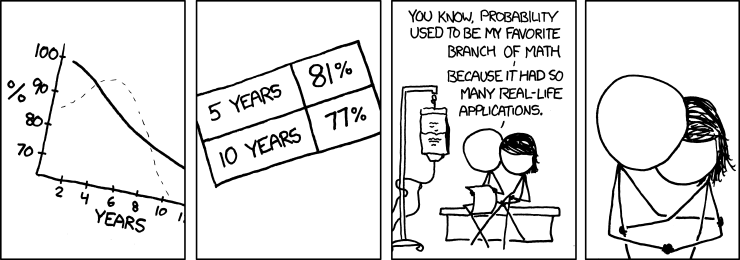

--- 
title: "Singapore Society in Numbers"
author: "Edited by Shannon Ang"
date: "Last updated `r format(Sys.Date(), '%d %B %Y')`"
site: bookdown::bookdown_site
output: bookdown::gitbook
documentclass: book
classoption: openany
bibliography: [book.bib, packages.bib]
biblio-style: apalike
link-citations: yes
github-repo: rstudio/bookdown-demo
description: "Understanding Singapore through quantitative social science"
---

```{r eval=FALSE, echo=FALSE}
bookdown::render_book("index.Rmd", "all")
```

# Preface {-}
```{r preface-fig, out.width='80%', fig.asp=.75, fig.align='center', include=FALSE, eval=F}

```

This online book is a compilation of resources aimed at advancing quantitative social science in Singapore. It is meant to be a 'living document', so it will be updated as frequently as possible. The main goal is to promote interest and rigour in quantitative social science on Singapore. It does so by: 

1. **Providing information on Singapore-relevant datasets** that are currently used to answer research and policy questions (Chapter \@ref(publicdata) and Chapter \@ref(restricteddata)). This includes: 
    + Descriptions of *publicly available* datasets and how to access them. This overview of the 'data landscape' will be helpful for social scientists to get started with research on Singapore, and prevent wasteful overlap in primary data collection across institutions.
    + A list of *restricted* or *non-publicly available* datasets that could be used to answer important research or policy questions if access was granted. If available, details on the dataset and reasons for data restriction will also be listed. It is hoped that this list will promote greater transparency in data sharing across research teams. 
    
2. **Maintaining a repository of replicable case studies on Singapore society** (with annotated code, where possible) which can be used for illustrations in any quantitatively oriented college-level class (Chapter \@ref(races) to Chapter \@ref(lifecourse)). These may be short summaries (blog-length) of published work, or side analyses that may not be appropriate for an academic journal but are useful for Singapore social science nonetheless.
3. **Occasional think pieces by researchers** on best practices and on how to improve quantitative social science in Singapore (Chapter \@ref(think)).

## About me {-}

Little write-up about myself

## The purpose of this book {-}

Little write-up about why this 'book' was written

## How to contribute {-}

Instructions on how to list a dataset, contribute a case study, or write a think piece for this page.

## Acknowledgements {-}

This book is being written through the **bookdown** package [@R-bookdown], which was built on top of R Markdown and **knitr** [@xie2015].

Contributors

```{r include=FALSE}
# automatically create a bib database for R packages
knitr::write_bib(c(
  .packages(), 'bookdown', 'knitr', 'rmarkdown'
), 'packages.bib')
```

